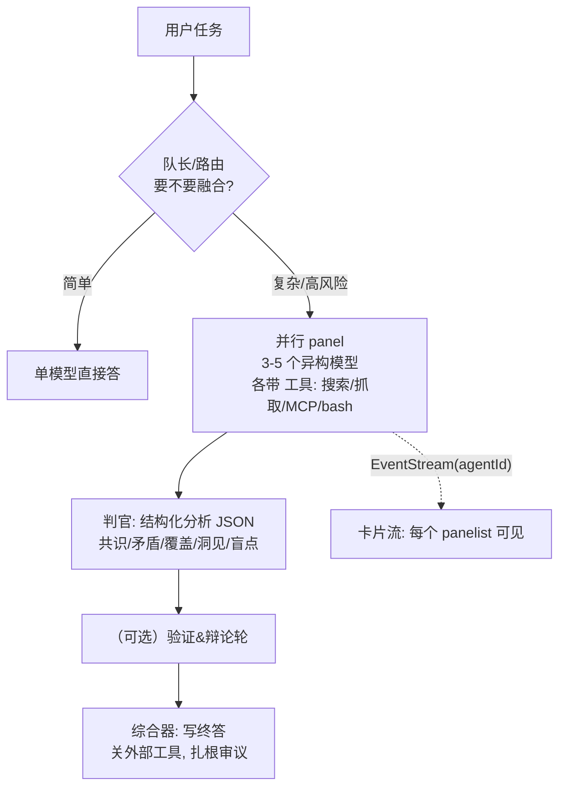

# 03 · 多模型融合（Fusion）方案：实现与超越

> 起因：OpenRouter 推出 **Fusion API**——"用一组模型达到 Fable 级智能、价格减半"。
> 依据：OpenRouter 官方文档（`plugins/fusion`、`server-tools/fusion`）+ 媒体报道。
> 结论：Fusion = 业界已知的 **Mixture-of-Agents（MoA）+ LLM-as-judge + 结构化综合**。它能做的，我们在 craft 上完全能做；而且因为我们是**有记忆、有真工具、有评测的本地 App**，可以系统性超越它。

---

## 1 · 它到底怎么做到的（官方精确版）

四步流水线（注意它**不是简单投票/取平均**）：

1. **判官先决定要不要融合。** 你的请求其实打到一个 **judge/fusion 模型**，它先看 prompt，**决定是否调用 fusion 工具**——简单任务直接答，不浪费钱（已自带"按需融合"）。
2. **并行扇出到 panel。** 触发后，prompt 并行发给 **3–5 个分析模型**，每个都开 **web search + web fetch**（官方是搜索+抓取；营销图里写的 "bash" 在文档里没有——这反而是我们的超越点，见 §4）。
3. **判官产出结构化分析（JSON）。** 同一个 judge 模型收到所有 panel 回答，输出**结构化分析**：共识 / 矛盾 / 部分覆盖 / 独特洞见 / 盲点。
4. **综合写终答。** judge 拿这份结构化分析写最终答案；**这一步关掉 web 工具**——因为"新鲜信息已经在 panel 回答里了，关掉工具让终答扎根于这次审议"。
- 还有**递归保护**（`x-openrouter-fusion-depth` 头，panel 模型不能再套娃调 fusion）。

**最关键的一句（决定我们怎么打）**：OpenRouter 自己说——**约 3/4 的提升来自"综合"这一步，只有约 1/4 来自模型多样性**。换句话说，**智能倍增器在综合层，不在"多跑几个模型"。**

---

## 2 · 这是什么技术（不是魔法）

- **Mixture-of-Agents（MoA）**（Together AI, 2024）：多个 LLM 生成 → 聚合器综合，分层迭代，稳定超过最强单模型。
- **LLM-as-judge**：用一个模型按**评分维度**裁决多份输出。
- **结构化综合**：把"共识/矛盾/覆盖/洞见/盲点"做成 schema，逼判官系统性交叉检查，而不是"挑一个最好的"。
- 图里 **self-fusion（同一个模型自融合）也能涨**，说明多样性可来自采样/温度，不一定非要多家模型——这是"预算版融合"的依据。

> 一句话：Fusion 把"多智能体 + 判官 + 结构化综合"打包成一行 API。我们要做的，是把同一套放进 craft，并在**综合层**和**我们独有的优势**上做得更狠。

---

## 3 · 在你软件里怎么实现（落到 craft + 你的架构）

这套**完美贴合**你已有的"队长→小队 + EventStream + 多模型连接"：

**直接复用 craft 的东西**：
- **多模型连接**已就位（craft `llm-connections` + 我之前的 `model-resolve`：DeepSeek/Qwen/Claude/GPT/Ollama）——panel 成员就是这些。
- **panel 成员 = craft 子会话/子智能体**，各带工具（你的 MCP 总线 / 浏览器 / shell）、各自独立干净上下文（正是"子智能体隔离"那条杠杆）。
- **判官 + 综合器 = 两次模型调用**，用结构化输出（craft 有 structured output 基础）。
- **EventStream 带 agentId**（你 AGENTS.md 的硬规则）→ 每个 panelist 在卡片流里可见、可审计、可停。
- 做成 craft 的一个**编排模式**（"融合模式"），不是默认全开（贵）。

MVP（最小可用）：3 模型 panel + 结构化判官 + 综合器，跑通一个任务即可对标 Fusion。

---

## 4 · 怎么超越它（你的不公平优势）

Fusion 是**无状态云 API、panel 只有 web 工具、单趟综合**。你是**有记忆、有真工具、有评测的本地 App**。按收益排序：

| 超越点 | 做法 | 为什么赢 |
|---|---|---|
| **A. 把 75% 的综合层做强（首要）** | 综合器用你最强的模型 + 更细的评分 rubric；高风险任务上**验证型/集成判官**（多判官再融合） | 官方说 3/4 收益在这步——你在这步多投入就直接超车 |
| **B. 证据级验证，不只判官嘴判** | 判官标出"矛盾/盲点"后，派**验证 agent 真去执行**：跑 bash/测试、抓引用源、核对事实，用**证据**消解矛盾而非投票 | Fusion 的判官只是"推理"；你能**运行**——这是质量天花板的差距（且正好补上评测/可观测 G1） |
| **C. 辩论/修订轮** | 把判官的矛盾点**发回 panel 让其修正**，再综合 | Fusion 是单趟；对争议点做一次便宜的二轮，质量再升 |
| **D. 记忆/上下文加持** | panel 和综合器都喂**用户分级记忆 + 项目上下文 + 历史决策** | 个性化融合，无状态云 API 做不到 |
| **E. 异构 + 本地 panelist** | 免费 Ollama + 便宜国产(DeepSeek/Qwen) + 1 个前沿 → 便宜买多样性；提供**纯本地融合模式** | 你掌控经济性；**本地模式=隐私优势**（云 Fusion 必然把 prompt 扇给多家） |
| **F. 自适应路由 v2** | 不止"要不要融合"的二选一，而是按任务类型学出**panel 规模+成分** | Fusion 的判官只做 go/no-go；你用评测学出每类任务的最佳配方 |
| **G. 校准的不确定性 / 敢弃权** | panel 不可调和且工具无法裁决时，**把分歧+置信度摊给用户**，而不是硬综合一个假共识 | 当"大管家"要让人信，诚实的不确定 > 假装确定 |
| **H. 评测驱动调优（复利护城河）** | 用评测集度量"哪种 panel+判官 prompt 在哪类任务赢"，自动调 | Fusion 一刀切；你越用越准 |

> 一句话超越法：**Fusion 把钱花在"多跑模型"，你把钱花在"更强的综合 + 真验证 + 记忆 + 评测调优"**——同样的 75% 杠杆，你按得更重。

---

## 5 · 风险与取舍（别踩）

| 风险 | 说明 / 应对 |
|---|---|
| **相关性错误** | 若 panel 都带同一训练偏见，"共识"会**自信地错**。→ 强制**异构模型族** + 证据级验证（B），别盲信共识 |
| **成本/延迟 ×N** | panel 越大越贵越慢。→ 自适应路由（F）+ 早出共识流式 + 缓存 panelist 结果，**融合只在"错的代价 > 多跑几次的代价"时开** |
| **判官是瓶颈** | 75% 收益在综合——判官/综合器弱则全盘封顶。→ 把最强模型 + 最好 prompt + 结构化输出放这里 |
| **隐私** | 扇出=把 prompt 发给多家。→ 敏感数据走**纯本地 panel（Ollama）**，这是你对云 Fusion 的差异化 |
| **递归爆炸** | panelist 又触发融合。→ 抄 Fusion 的 depth 头/递归保护 |

---

## 6 · 落地建议

1. 把"**融合模式**"做成 craft 的一个编排模式（手动开 / 队长自动判要不要开）。
2. MVP：3 异构模型 panel（各带工具）→ 结构化判官 JSON → 综合器（关外部工具）。直接对标 Fusion。
3. 再按 §4 加：**证据级验证（B）→ 记忆加持（D）→ 评测调优（H）**，逐步超越。
4. 这块其实就是你要的"**大管家 + 多智能体编排**"的杀手级实例，且天然推进世界顶尖的 **评测/可观测（G1）**——三件事一起做。

---

## 7 · 作为设置项的融合功能（用户决策 D5）

按 `04-产品决策记录.md` 的 **D5**：融合做成**设置页里的一项**，用户自己配。控件：

- **开关模式**：关（**默认**）/ 常开 / 智能开（队长按任务自动判要不要融合）。
- **融合规模**：融合几个模型（panel 大小，建议 2–5）。
- **panel 成分**：从已连接的模型里选谁进 panel（可混 国产 / 本地 / 前沿）。
- **判官 / 综合器**：指定判官与综合器模型（默认 = panel 第一个）。
- **作用范围**：由**队长**用，还是允许**队员**也用。
- （可选）预算档：Quality / Budget（影响 panel 与 token 上限）。

实现上是 craft 设置系统的一项（写进 craft `config`/preferences，符合 D1"手动编辑写同一份真相"），运行时由编排层读取。**默认关** = 不影响新手、不额外烧钱；要用的人自己开。

## 8 · executor 必读：精确技术说明与坑

最容易退化成"扇出 3 个模型拼接"——那等于丢掉 75% 的价值。逐条照做：

1. **部分失败要扛**：N 个 panelist 并行，给**每个**设超时；**一个超时/报错不能拖垮全局**——失败的标记跳过，**至少 1 个成功**才进判官；全失败则降级为单模型直答 + 明确提示。
2. **判官结构化输出**：用 structured output / JSON schema：`{consensus, contradictions, partial_coverage, unique_insights, blind_spots}`。**解析必须容错**（模型可能不严格 JSON）→ JSON 修复 / 一次重试，再失败再降级。
3. **综合器是重点**：综合器**关掉外部工具**、只扎根 panel 回答（抄 Fusion 设计）；用你最强模型 + 细 rubric——75% 收益在这步。
4. **成本/延迟闸**：panel 大小、并发数、token 上限全部**可配可封顶**；默认关（D5）。智能开时由队长按任务难度判，别无脑全开。
5. **递归保护**：抄 Fusion 的 depth 头——panelist **不能再触发融合**，否则指数爆炸。
6. **身份**：每个 panelist 输出是带 `agentId` 的 `SessionEvent`（AGENTS 规则 15），卡片流可分辨、可单独停。
7. **离线确定性测试（也是评测/可观测 G1 的起点）**：用 faux/mock 模型（craft/pi 自带 faux）写单测——给定 N 份固定假回答 → 断言判官结构 + 综合被调用 + 部分失败路径，**零网络**。
8. **DoD 加测**：故意让一个 panelist 超时，融合仍产出终答；判官输出可解析；成本封顶真的生效；默认关时零额外开销。

---

Sources（供核对）：OpenRouter 官方文档 `plugins/fusion`、`server-tools/fusion`；媒体报道（"75% 来自综合"）。
