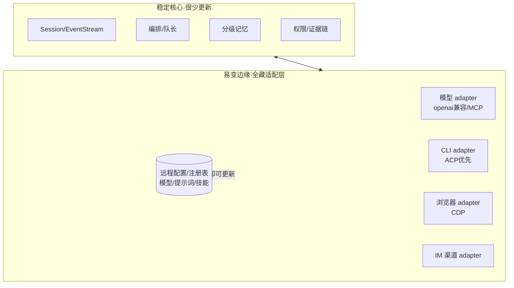

# 07 · 难点清单 与 更新韧性（少更新的架构）

> 两部分。**Part 1**：哪些任务真的难 / 执行 agent 容易做砸或跑偏，怎么兜。**Part 2**：为什么 AI 软件老更新、怎么让 Fleet 少更新还能适配环境变化。
> **核心洞见**：这两件事根因相同——**易变的外部边界漏进了核心**。把边界关进适配层，既兜住执行难点，又少更新。

---

## Part 1 · 难点 & 跑偏风险登记表

| 任务 | 难在哪 | 跑偏风险（agent 容易怎么做错） | 兜法 |
|---|---|---|---|
| **终端 / CLI Runtime Host**（D3 首攻） | local-only RPC、PATH/环境探测、各 CLI 版本输出差异、后续 ACP vs PTY、权限与回放边界 | 一上来做 PTY/UI；执行用户任意命令；把终端做成第二套 session；只做路径输入框而不是 Runtime Catalog | M0 第一批重做：先做 Runtime Catalog、ACP 健康测试、进程生命周期；启动/写入/命令执行接 permission、timeline |
| **浏览器 选元素/标注/截图**（下一阶段） | CDP 注入、坐标换算(DPR/滚动/缩放)、元素→截图裁剪、iframe/跨域、SPA 动态 DOM | 用脆弱的 `querySelector` 黑客替代 CDP；截图坐标对不上；跨域 iframe 崩 | `06` 已补"executor 必读"详解；逻辑件我可写带测模块 |
| **多模型融合 Fusion**（D5） | 并行 + 部分失败、判官结构化输出解析、成本/延迟封顶、递归保护 | 退化成"扇出 3 个模型拼接"，**丢掉判官+综合（75% 价值在这）** | `03` 已补"executor 必读"详解；编排器我可写带 faux 单测模块 |
| **分级记忆 + 检索**（D2） | 该记什么(蒸馏)、检索相关性、衰减、不塞爆窗口、删除即真删 | 另起第二套 store（违反铁律）；把记忆全塞进上下文 | `05` 接口隔离；写进 craft session 真相；检索只取少量片段 |
| **托管外部 CLI**（后续） | ACP vs PTY、各 CLI 怪癖、鉴权、官方猫鼠 | 用 PTY 抓屏解析（脆）；硬编码路径 | 优先 **ACP/SDK/MCP**，PTY 兜底；探测+适配层 |
| **多账号 Profile 切换**（D4） | 不退出就切、不污染 CLI 原库、凭据隔离 | 改全局配置文件（互相踩）；做成 ToS 违规轮换 | 每会话注入各自凭据/HOME；只切指针不删；不做反检测 |
| **其他 CLI 历史归集**（D4） | 各家格式不一、只读安全、格式会变 | 写进它们的库（损坏）；硬解析某版本格式 | 每 CLI 一个**只读** adapter + 容错版本化 |
| **去 Craft 化 / 分叉**（待拍板） | 改名不破坏、上游可合性 | 一上来全量改名 = 事实硬分叉，再也合不了上游 | 先定**软/硬分叉**；建议软分叉，品牌只做用户可见层 |
| **评测 + 可观测**（待拍板） | 建真正的 agent 评测/回归 + trace | 直接跳过 → 规模一大失控 | 早搭骨架；融合的 faux 单测就是起点 |

> 规律：**上表前 6 项都是"易变外部边界"任务**——它们既最难、又最易跑偏、又是更新频率的来源。下面 Part 2 用同一招（适配层）一起解决。

---

## Part 2 · 为什么 AI 软件老更新 + 怎么少更新

### 为什么频繁更新（根因）
1. **模型变化快**：新模型、弃用、参数/定价变。
2. **提供商 API/鉴权变**：尤其 OAuth/登录态——account 工具天天追（你说的"斗智斗勇"）。
3. **Agent 生态在动**：MCP 规范、工具格式、SDK。
4. **被包的 CLI 自己在变**：历史/配置格式。
5. **前沿期 bug 多 + 安全补丁**（Electron/依赖）。
6. **竞争军备**：功能你追我赶。

### 怎么让 Fleet 少更新（架构答案）
一句话：**把"会变的"关在适配层里，"你的核心"保持稳定；能用数据/配置解决的，绝不写进二进制。**

1. **防腐层 / 适配器（最重要）。** 每个会变的外部东西——每个模型 provider、每个 CLI 的历史/配置格式、每个 IM 渠道、浏览器/CDP——都藏在一个**稳定的内部接口**后面。外面变，只改那**一个 adapter**，不动全身。（这正是"执行 agent 不跑偏"的同一招：边界清晰。）
2. **配置/注册表 > 硬编码。** 模型清单、端点、provider 怪癖、提示词 → 做成**数据 / 远程配置**，**不发新版就能更新**。新模型 = 加一条配置，不是发版。craft 的 `model-fetchers`/`sources` 已是这思路。
3. **押标准，不押单家。** 建在稳定标准上——**OpenAI 兼容 API、MCP、Skills**——随生态的稳定走，而不是追每家私有接口。
4. **运行时能力探测 + 优雅降级。** 别假设固定环境（"Chrome 在路径 X"）；**探测**有什么、缺了就降级。环境变了不崩。
5. **可热更的层。** Skills / 提示词 / 模型配置 / MCP server / 渠道 adapter 做成**数据或插件**，用户或远程配置就能刷新——"更新"发生在数据层，不在二进制。
6. **别打 ToS 猫鼠战。** account 工具更新频繁，正因为它们在和官方对抗。**建在官方 API（稳定路径）上**，别建在反检测上（D4 已定）。
7. **软分叉跟上游。** 跟着 craft 上游合并，你白捡它的更新；硬分叉就得自己追一切。→ 少更新负担（也是建议软分叉的原因）。
8. **agent-native 当逃生阀。** craft "加个模型/源 = 跟 agent 说一句"——很多适配本就是 prompt，不是发版。把易变配置交给这条。

### 一图：稳定核心 + 易变边缘

**结论**：你不可能让"模型/提供商"不变——但你可以让**这些变化只打在适配层和配置上，碰不到核心**。这样 90% 的"环境变化"靠改配置或换一个 adapter 吸收，而不是发新版本；剩下的安全补丁随上游软分叉合并即可。

---

## 当前执行说明

- 当前环境已经能通过 `./scripts/craft.sh ...` 运行 craft，不再把“build 不了”作为执行前提。
- CLI Runtime 在干净基座上重新落地；先补 AionUi 式 Runtime Catalog / Runtime Adapter，而不是扩展首页卡片。
- 浏览器人类层后续触碰 UI，仍按 `AGENTS.md` 先审查后改。
- 若要推进 Fusion、记忆、浏览器等纯逻辑件，优先写成带 faux/mock 单测的模块，再接入 craft。
