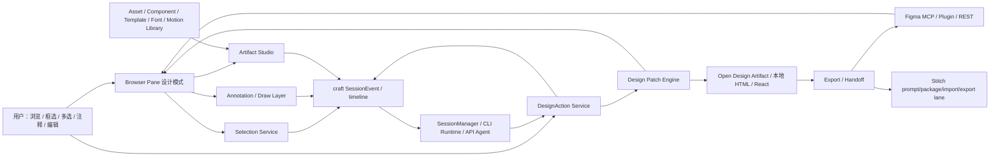

# 15 · 设计工作流一体化方案（Open Design / Figma / Stitch / Typography / Motion）

> 状态日期：2026-06-19
> 目标：把 Open Design / Claude Artifacts 式 artifact loop、Figma 原生设计能力、Google Stitch 式 prompt/image-to-UI/code/Figma handoff、字体/颜色/动画创意编辑融入 Fleet；第一落点不是新孤岛页面，而是在原有 **内置浏览器 + 网页标注** 能力上扩展成设计审查、框选、多选、批量注释、受控编辑、字体色彩编辑、动画生成/编辑和交付工作流。

## 1 · 产品定位

Fleet 不应该先重造一个完整 Figma。更稳的定位是：

**Agent 驱动的设计工作流控制台 + 本地可编辑 artifact 画布 + 字体/颜色/动画创意层 + Figma/Stitch/Open Design 互通层。**

这里的 Agent 驱动不是“AI 在旁边给建议”。craft-agents-oss 的重要设计哲学是：软件本身可以被 AI 编辑，人类和 AI 在同一个工作台里共同操作。Fleet 继承这个原则后，Artifact Studio 的每个手动动作都必须有等价的结构化 action/tool 入口，AI 可以查询选区、添加批注、插入媒体、改参数、生成 patch、保存组件、导出交付；人类拖拽和 AI 工具调用最终写入同一个 session timeline、permission、patch、diff 和回滚链路。

用户在同一个项目里完成：

1. 写 brief / 上传参考图 / 粘贴网页或 Figma 链接。
2. 生成或打开一个网页 / artifact / prototype。
3. 在原浏览器标注面板里点选、框选、多选元素。
4. 对选中元素一起批量注释、批量改样式、让 Agent 按选择局部修改。
5. 对 AI 生成的网页、APP prototype、PPT/deck、商品页、海报、视频页直接做手动微调：插入图片/视频/形状，调位置、尺寸、旋转、圆角、模糊、裁切、蒙版、层级和参数。
6. 连接本机字体、项目字体、合法网络字体或用户授权字体包，直接编辑文字内容、字体、字号、字重、行高、字距、变量字体轴、文字特效和排版 token。
7. 编辑颜色、品牌色板、渐变、吸管取色、对比度、主题 token，支持从素材/截图提取 palette。
8. 生成和编辑网页/APP/PPT/商品页可用动画：入场/退场/循环/滚动触发/交互动效/视频时间线/关键帧/easing，并把动画保存到库。
9. 建立自己的 UI 效果库、组件库、媒体库、字体库、色板库、动画库和网页/APP/PPT 骨架模板，在侧边栏浏览、搜索、拖入当前 artifact。
10. 必要时同步到 Figma native canvas，或从 Figma 读取设计上下文。
11. 对接 Stitch 的 prompt/image-to-UI 和 Figma/code handoff 思路，但不把 Stitch 当内部强依赖。
12. 导出代码、Figma 交付、截图、动画、视频、评测记录、设计系统文档和 session 证据链。

## 2 · 参考来源与边界

| 来源 | 当前用法 | 复制边界 |
|---|---|---|
| craft browser pane / `browser_tool` | 第一落点。已有 BrowserWindow/BrowserView、CDP snapshot、screenshot、click/fill/select/scroll/evaluate、toolbar、browser atom、session timeline 基础 | 主基座，直接改 |
| Open Design | 迁移工作流模型：`brief -> plugin -> direction -> DESIGN.md -> artifact -> edit/comment/tweak/draw -> handoff -> memory`；迁移 manual edit、live artifacts、skills/plugins/eval/export 的绿灯实现 | Apache-2.0 绿灯；复制模板/设计系统/技能前检查子目录 LICENSE |
| Claude Artifacts / Claude Design 类体验 | 只借鉴“聊天旁边专用 artifact 窗口、可继续修改和分享”的产品形态 | 不复制闭源 UI、文案、品牌和新编辑功能 |
| Figma 官方 MCP / Plugin API / REST | 作为 native Figma 互通层。官方 MCP 已支持读取组件/变量/layout，并可创建/修改 frames、components、variables、auto layout；Plugin API 可改节点位置/层级/文本/样式；REST 适合文件、变量、dev resources、webhook | 外部服务/API；不复制 Figma 资产，不绕过权限/席位限制 |
| Google Stitch 官方文档/产品 | 作为 prompt/image/wireframe -> UI/code/Figma handoff 的外部参考。Fleet 做可导入/可导出/可复现的本地工作流，不依赖抓取 Stitch 私有状态 | 外部服务；不做非授权 scraping |
| Adobe Firefly / Adobe Express | 参考生成图片、生成/编辑视频、Generative Fill、文字特效、品牌字体/颜色和模板化编辑能力 | 外部服务/API/产品行为参考；不复制 Adobe UI、品牌、模型或私有资产 |
| SVGator animation templates | 参考 SVG/Lottie/GIF/video 多格式动画模板库、动画分类和可编辑 starter project 形态 | 外部服务/模板参考；不抓取私有状态；模板导入必须看 SVGator 授权 |
| KDE Kdenlive | 参考专业视频编辑的时间线、轨道、剪辑、转场、音视频效果概念 | GPL-3.0；不能复制源码进 Fleet，除非未来明确接受 GPL 传染边界 |
| Remotion | 参考 React 程序化视频、组件化 video rendering、Lambda/cloud render 思路 | 特殊许可证；不能默认复制源码或作为内置依赖，需单独商业/许可证评估 |
| HyperFrames | 参考 HTML/CSS/media/seekable animation 到 deterministic MP4、agent-friendly HTML authoring、Catalog/Studio/Frame.md 思路 | Apache-2.0 强候选；未获用户明确写入绿灯表前仍只黑盒参考 |

官方来源核对：

- Figma MCP server：`https://help.figma.com/hc/en-us/articles/32132100833559-Guide-to-the-Figma-MCP-server`
- Figma MCP get started：`https://help.figma.com/hc/en-us/articles/39216419318551-Get-started-with-the-Figma-MCP-server`
- Figma MCP FAQ：`https://help.figma.com/hc/en-us/articles/39252411778583-Figma-MCP-server-FAQs`
- Stitch docs：`https://stitch.withgoogle.com/docs/`
- Claude Artifacts help：`https://support.anthropic.com/en/articles/9487310-what-are-artifacts-and-how-do-i-use-them`
- Adobe Firefly overview：`https://helpx.adobe.com/firefly/web/get-started/learn-the-basics/adobe-firefly-overview.html`
- Adobe Express text effects：`https://www.adobe.com/express/feature/ai/design/text-effects`
- SVGator animation templates：`https://www.svgator.com/animation-templates`
- Kdenlive GitHub：`https://github.com/KDE/kdenlive`
- Remotion GitHub：`https://github.com/remotion-dev/remotion`
- HyperFrames GitHub：`https://github.com/heygen-com/hyperframes`

## 3 · 第一落点：浏览器标注页升级为设计画布

现有 `docs/06-浏览器与网页标注方案.md` 不再只是“网页点评”。它升级为设计工作流的第一个可见入口：

| 模式 | 用户动作 | 系统动作 |
|---|---|---|
| 浏览 | 打开网页、artifact、prototype、本地 HTML | 复用 `browserPane.create/navigate/focus/list` |
| 单选 | 点一个元素 | 取 CDP/accessibility ref、selector、box、截图区域、文本/role/name |
| 框选 | 拖出矩形框 | 取框内候选元素，按可见面积/层级/交互性过滤，形成 selection set |
| 多选 | Shift/Command 点选或框选后增删 | 维护 `selectionId` + refs/boxes/screenshot/provenance |
| 批量注释 | 对 selection set 写批注或文字指令 | 写入 session timeline，Agent 可引用；不直接改页面 |
| Comment AI | 对选区下指令“这组卡片更紧凑”“这三个按钮统一成主色” | Agent 只拿选区上下文和截图证据，生成 patch |
| Edit | 手动改文本、链接、颜色、字体、间距、圆角、token | 对 Open Design artifact / 本地可编辑 HTML 生成受控 patch |
| Tweaks | 改全局 token / theme / spacing / density | 改 `DESIGN.md` / token manifest / artifact metadata |
| Draw | 手画框、箭头、批注 | 作为审查标注，不在 v1 直接变更源代码 |
| Drag/Arrange | 拖动/重排选中的可编辑区域 | 只生成语义布局 patch，如 reorder、grid span、alignment、gap；不默认写 absolute positioning |
| Asset Insert | 拖入图片、视频、SVG、图标、音频、局部组件 | 写入项目媒体库和 artifact manifest，画布里生成可编辑元素 |
| Text/Font | 直接编辑文字、换字体、调字重/字号/行高/字距/变量字体轴、生成文字特效 | 保存为 typography token、font asset 和 text effect patch |
| Color | 调色板、渐变、吸管、品牌色、对比度、状态色、主题 token | 保存为 color token / palette patch |
| Mask/Crop | 给图片/视频创建剪切蒙版，在蒙版内部缩放、移动、旋转素材 | 保存为非破坏性 `mask + mediaTransform`，不改原文件 |
| Effects | 调透明度、模糊、亮度、对比度、饱和度、清晰感、背景模糊、阴影 | 保存为 CSS/filter/token patch；需要真实重采样时走导出阶段 |
| Shape/Vector | 画矩形、圆形、线条、箭头、多边形、自由形状 | 简单形状直接落 SVG/CSS；复杂手绘可作为 AI implementation request |
| Motion/Timeline | 生成动画、套动画模板、编辑关键帧、easing、duration、delay、循环、滚动触发、视频时间线 | 保存为 `AnimationTimeline` / `MotionPreset` / keyframe patch，可编译到 CSS/WAAPI/SVG/Lottie/video |
| Library | 从侧边栏调用自己的 UI 效果、组件、媒体、骨架模板 | 从 `DesignLibrary` 复制实例到当前 artifact，并记录来源和版本 |

关键约束：

- 对普通远程网页，默认只能“选择 + 注释 + 截图 + 给 Agent 上下文”，不能直接改站点源码。
- 对 Fleet 生成的 artifact、Open Design artifact、本地项目 preview，才开放受控编辑和拖动。
- 多选批量编辑必须先做 capability 判断：文本/样式可批量改；布局只对标记为 editable region 的容器开放。
- AI 生成内容的微调必须以“人可直接拖调”为主，不能每次都逼用户说“大一点、小一点、往左一点”。AI 负责生成初稿、根据草图/批注实现复杂改动、整理代码和导出。
- 图片/视频/形状编辑采用非破坏性模型：原素材不被改写，画布只保存 crop/mask/filter/transform 参数。
- 字体、颜色、动画也采用非破坏性模型：保存 font/color/motion token、keyframe、timeline、preset，不直接把不可维护的内联样式和随机 JS 塞进页面。
- 字体文件、网络字体、动画模板、AI 生成素材必须记录来源和授权；本机字体默认只引用，不自动打包导出，除非许可证允许。
- 所有人类动作都进入 session timeline，不能走 UI 暗管。
- 所有 UI 动作都必须能被 AI 以同一套结构化动作复现；不能只把状态存在 renderer local state、临时 DOM mutation 或无法回放的画布私有对象里。

## 3.1 · 人类和 AI 共用的编辑契约

Artifact Studio 不是单纯的人类画布，也不是让 AI 盲目操作鼠标。它要提供一个双入口同源的编辑契约：

| 入口 | 例子 | 落点 |
|---|---|---|
| 人类 UI | 拖入图片、框选三张卡片、改圆角、调蒙版内图片位置 | 生成 `DesignAction`，交给 patch engine |
| AI 工具 | “把这组商品卡统一成 12px 圆角并保存为组件” | 调用同一套 `DesignAction` / `DesignPatch` 服务 |
| 自动化/模板 | 套用 SaaS landing 骨架、导入 Figma 变量、批量替换素材 | 批量 action，仍写入 timeline |

`DesignAction` 至少包含：

- `actor`：`user` 或 `agent`。
- `agentId/runtime`：AI 发起时必须记录，人工发起可为空。
- `surface`：browser selection、artifact、deck、Figma link、library。
- `selectionId` / `elementIds`：动作作用域。
- `operation`：select、annotate、insertAsset、updateTransform、updateStyle、createMask、updateMediaTransform、group、saveLibraryItem、export 等。
- `payload`：参数化数据，不保存不可解释的 DOM 快照。
- `permission`：本地写文件、导出、Figma 写入、外部 API 调用等权限结果。
- `rollback`：可撤销 patch 或导出前快照。

这条契约优先复用 craft 已有模式：

- session tools 是 AI 调用软件能力的入口，现有 `browser_tool` 已证明浏览器操作可以工具化。
- `SessionManager` / `SessionEvent` 是时间线真相，不新增第二套会话。
- permissions、file diff、message annotations、preferences/config 写入都已有可审计路径，新设计能力必须接进去。
- 对浏览器选择阶段，可以先扩展 `browser_tool` 或 browser pane RPC；对 Artifact Studio 阶段，建议新增结构化 `design_tool`，但底层仍是同一个 `DesignAction` 服务，避免 UI 和 AI 两套实现。

## 4 · 数据模型

新增设计工作流不另建第二套 session。它只在 craft session/timeline 上挂结构化事件和项目文件：

| 对象 | 作用 |
|---|---|
| `DesignProject` | 当前设计任务，绑定 workspace/session/artifact/Figma 链接 |
| `DesignBrief` | 目标、受众、平台、约束、参考图、风格词 |
| `DesignSystem` | `DESIGN.md`、tokens、components、brand rules |
| `DesignArtifact` | HTML/React artifact、预览 URL、source path、manifest |
| `DesignPage` | artifact 内的页面、slide、screen、section；PPT/deck、APP 多屏、商品页多 section 都统一成 page/screen |
| `DesignSelection` | 单选/框选/多选结果：refs、selectors、boxes、screenshot、DOM/accessibility 摘要 |
| `DesignAnnotation` | 用户在选区上的批注、Draw 标记、跟进状态 |
| `DesignAction` | 人类 UI 或 AI 工具提交的统一编辑动作，作为 patch engine 的输入 |
| `DesignPatch` | AI 或手动编辑生成的可回滚 patch，带来源 selection 和权限结果 |
| `DesignAsset` | 图片、视频、SVG、音频、图标、字体、外部素材引用；记录原路径、hash、许可/来源、尺寸、MIME |
| `DesignElement` | 画布元素：text、image、video、shape、group、component、frame、embed、chart、section |
| `FontAsset` | 本机字体引用、导入字体文件、网络字体声明；记录 family、style、weight、format、source、license、是否可打包 |
| `TypographyToken` | font family、font size、line height、letter spacing、weight、case、variable font axes、text effect |
| `ColorPalette` / `ColorToken` | 品牌色、语义色、渐变、状态色、对比度约束、来源和版本 |
| `MediaTransform` | 素材在元素内部的缩放、偏移、旋转、object-position/object-fit、播放区间 |
| `Mask` | 矩形/圆角/圆形/多边形/SVG path/自定义 clip-path；可绑定图片、视频、group |
| `VisualEffect` | opacity、blur、brightness、contrast、saturate、shadow、backdrop blur、blend mode、grain/noise 等非破坏性效果 |
| `AnimationTimeline` | artifact/page/element 级时间线：tracks、clips、duration、fps、markers、scroll/interactivity triggers |
| `Keyframe` | 某元素在某时间点的位置、尺寸、颜色、opacity、filter、path、mask、text、camera 等动画值 |
| `MotionPreset` | entrance、exit、loop、hover、scroll、transition、loading、micro-interaction、video template |
| `DesignLibraryItem` | 用户自建 UI 效果、组件、媒体、骨架模板；可复用、可版本化 |
| `FigmaLink` | Figma file/node/component/variable/dev resource 映射 |
| `HandoffExport` | HTML/React/Next/PDF/PPTX/ZIP/Figma/dev resource 导出记录 |
| `Provenance` | 来源：用户、agent、Figma、Stitch、Open Design、外部截图；记录时间和权限 |

## 5 · 技术架构

模块落点：

| 模块 | 首选位置 |
|---|---|
| 选择/框选/多选 RPC DTO | `app/packages/shared/src/protocol/design-*` 或 browser pane protocol 扩展 |
| 选择服务 | `app/packages/server-core/src/services/design-selection-*`，底层调用 BrowserPaneManager/CDP |
| 浏览器设计模式 UI | `app/apps/electron/src/renderer/components/browser/*` 和现有 browser toolbar/atom |
| native overlay / browser host | 真实浏览器栈在 `app/apps/electron/src/main/browser-pane-manager.ts`、`app/packages/server-core/src/sessions/RemoteBrowserPaneManager.ts`、`app/packages/server-core/src/handlers/browser-pane-manager-interface.ts`、`app/packages/shared/src/agent/browser-tools.ts`、`app/apps/electron/src/renderer/atoms/browser-pane.ts`；main 侧负责真实窗口/视图管理，server-core 侧负责远端接口和 session 能力边界 |
| 注释 UI | 复用 `app/packages/ui/src/components/annotations/*`，不要另造 annotation 系统 |
| artifact 编辑 | 在 Open Design manual edit/live artifact 模式上扩展成 Fleet Artifact Studio |
| AI 可调用编辑工具 | 先复用/扩展 browser capability；Artifact Studio 阶段新增 `DesignAction` 服务和可暴露给 session tools 的 `design_tool` |
| 媒体/模板库 | 新增 `DesignLibrary`：媒体库、UI 效果库、组件库、骨架模板库，侧边栏浏览/拖入 |
| 字体/文字服务 | 新增 font discovery/import service：本机字体扫描 local-only、项目字体注册、网络字体引用、字体授权元数据 |
| 颜色/品牌服务 | 新增 palette/token service：吸管、截图取色、图片取色、品牌 palette、对比度检查、主题 token |
| 动画/视频服务 | 新增 motion service：关键帧、timeline、animation preset、HTML/SVG/Lottie/CSS/WAAPI/video export，优先 HTML-native/seekable 模型 |
| Figma 互通 | 新增 Figma bridge，先读 context，再写 canvas；写入必须权限确认 |
| Stitch 互通 | 先做 prompt/DESIGN.md/export package；不抓取未授权私有状态 |

## 5.1 · Artifact Studio：手动微调能力

Artifact Studio 是 AI 生成内容的直接编辑器，覆盖网页、APP prototype、PPT/deck、商品页、海报、仪表盘、视频页等输出。它不是普通远程网页编辑器，只对 Fleet/Open Design artifact、本地项目 preview 或明确导入的可编辑代码开放。

| 能力 | v1 行为 | 存储方式 |
|---|---|---|
| 插入图片 | 从本地、剪贴板、截图、媒体库拖入；可替换选中图片 | `DesignAsset` + image element |
| 插入视频 | 拖入视频，设置封面、循环、静音、裁切、播放区间 | `DesignAsset` + video element + playback metadata |
| 调整尺寸/位置 | 拖拽 handles、输入 x/y/w/h、对齐、分布、吸附到 grid/section | `transform/layout patch` |
| 旋转/缩放 | 旋转角度、scale、flip、锁定比例 | `transform patch` |
| 圆角/直角 | 单独调四角或统一 radius；支持 pill/circle preset | `border-radius token/style patch` |
| 剪切蒙版 | 矩形、圆角、圆形、多边形、SVG path、自定义形状做 mask | `Mask` + `clip-path`/SVG mask |
| 蒙版内调整 | 在 mask 内平移、缩放、旋转图片/视频，类似 Figma crop | `MediaTransform` |
| 模糊/清晰感 | blur、backdrop blur、contrast、brightness、saturate、opacity、shadow | `VisualEffect`；清晰感 v1 用 contrast/sharpen-like filter 表达，不改原素材 |
| 形状绘制 | 矩形、圆形、线、箭头、多边形、自由路径 | SVG/CSS shape element |
| 画形状让 AI 实现 | 用户画草图/形状并写一句意图，AI 将其实现成 SVG/CSS/React 组件 | `DesignAnnotation` -> `DesignPatch` |
| 层级/group | bring forward/back、group/ungroup、lock/hide | element tree patch |
| 多选批量改 | 多个元素一起改尺寸、圆角、阴影、字体、颜色、间距、对齐 | selection-scoped patch |
| 字体/文字编辑 | 直接双击改文案，切换本机/项目/网络字体，调字重、字号、行高、字距、变量字体轴 | `TypographyToken` + text element patch |
| 颜色编辑 | 色板、渐变、吸管、图片取色、品牌色、语义色和对比度检查 | `ColorPalette` / `ColorToken` patch |
| AI 文字特效 | 类 Adobe Express 文本特效：用 prompt 生成纹理/材质/装饰文字，保留可编辑文本和生成结果 | `TextEffect` metadata + raster/vector asset，必须记录来源和授权 |
| 动画生成/编辑 | 选中元素生成入场/循环/交互动效；编辑 keyframes、easing、duration、delay、timeline、触发方式 | `AnimationTimeline` + `Keyframe` + `MotionPreset` |
| PPT/deck 调整 | slide 列表、页面尺寸、母版/模板、元素动画占位 | `DesignPage` + deck manifest |

原则：

- 所有媒体编辑默认非破坏性：保存参数，不改原文件。
- 生成代码时由 patch engine 把参数落成 CSS/SVG/HTML/React，而不是在 UI 里直接写不可维护的随机 DOM。
- 能参数化的优先参数化，能 token 化的优先 token 化；用户可直接输入精确数字。
- AI 不再承担“微调鼠标”的职责，AI 负责把用户视觉操作整理成稳定实现；但 AI 必须能通过 `DesignAction` 做同样的结构化编辑，不能只能读不能改。
- 字体、色彩和动画先做可编辑参数和 token，再编译为 CSS/SVG/WAAPI/Lottie/video；不要一开始就把它们固化成不可编辑图片。

## 5.2 · 侧边库：资产、效果、组件、骨架模板

侧边栏需要有一个设计资源浏览器，服务“自己建库、随时调用”：

| 库 | 内容 | 典型用途 |
|---|---|---|
| Media Library | 图片、视频、音频、SVG、图标、logo、商品图、背景图 | 拖到商品页、PPT、APP mock、落地页 |
| Font / Typography Library | 本机字体引用、导入字体、网络字体、字体组合、标题/正文/按钮文字样式、AI 文字特效 | 一键换字体、保存品牌字体系 |
| Color / Palette Library | 品牌色、语义色、渐变、图片取色结果、对比度合规组合 | 统一网页/APP/PPT/商品页视觉 |
| Component Library | hero、pricing、card、navbar、footer、form、modal、product gallery、chart block | 复用网页/APP 组件 |
| Effect Library | glass、glow、grain、shadow、mask preset、blur preset、hover、motion preset | 统一 UI 效果，不每次重写 |
| Motion / Animation Library | SVG/Lottie/CSS/WAAPI 动画、入场/退场/循环/滚动触发、加载动画、产品动效、视频片头片尾 | 网站编辑、APP prototype、PPT/deck、商品页、视频导出 |
| Video Template Library | HTML-native video scenes、caption blocks、transition、overlay、chart/map animation、social ad layouts | 生成和编辑动画视频 |
| Skeleton Template Library | SaaS landing、mobile app、dashboard、商品页、PPT deck、social carousel、email、poster | 快速生成骨架，再让 AI 填内容 |
| Brand Library | `DESIGN.md`、tokens、字体、色板、spacing、radius、voice | 控制所有 artifact 的品牌一致性 |

库的来源：

- 用户自建：从当前选区“保存为组件/效果/模板”。
- Open Design 绿灯模板/设计系统：逐目录查 LICENSE 后导入。
- Figma：读取用户授权的组件/变量后建立 `FigmaLink`，不复制受限资产。
- Stitch：用户授权导入的输出可保存成模板或参考。
- SVGator：只作为动画模板库交互参考；具体模板导入必须检查其授权，不抓取用户未授权项目。
- HyperFrames：适合作为 HTML-native motion/video 方向参考；未纳入绿灯前不复制源码。

## 5.3 · Patch 模型：不要把画布变成垃圾代码

可视化编辑必须最后生成可维护代码：

- 文本、样式、属性：优先写局部 patch。
- 字体：优先写 `TypographyToken` 和 `FontAsset` 引用；导出时按授权决定是否打包字体文件、引用网络字体或降级到 fallback stack。
- 颜色：优先写 `ColorToken` / CSS variables / design tokens；批量换色不直接散落内联 hex。
- 文字特效：保留可编辑文本、prompt、seed/model/source、生成资产；不要只留下无法修改的 raster 图。
- 图片/视频：写 asset manifest + element patch，不把 base64 大文件塞进 HTML。
- 蒙版/crop：写 `mask + mediaTransform`，导出时编译成 CSS `clip-path`、SVG mask、`object-position` 或 wrapper transform。
- 动画：写 `AnimationTimeline`、`Keyframe`、`MotionPreset`；网页导出优先 CSS/WAAPI/SVG/Lottie，视频导出再编译为 MP4/GIF/WebM。
- 拖动：优先映射到 grid/flex/order/gap/alignment；只有用户明确选择自由定位画布时才写 absolute positioning。
- 自由形状：简单形状写 SVG；草图式意图先作为 annotation，AI 实现后用户验收。
- PPT/deck：保存为 page/slide manifest，导出 HTML/PDF/PPTX 时再编译。

## 5.4 · 字体、文字和颜色编辑

字体和颜色不能只是 CSS 输入框，要成为品牌系统和 artifact 编辑的共用能力：

| 能力 | v1 行为 | 边界 |
|---|---|---|
| 本机字体连接 | 扫描并列出系统字体，用户可在当前机器预览和引用 | `LOCAL_ONLY`；默认不随项目打包，除非许可证允许 |
| 项目字体导入 | 用户导入 `.woff2` / `.woff` / `.ttf` / `.otf`，记录来源和授权 | 未知许可证只能私有项目使用，不进入公共模板库 |
| 网络字体 | 支持合法网络字体 URL / CSS / provider 引用 | 记录 provider、URL、fallback、加载策略；不绕过 Adobe Fonts 等授权 |
| 文字编辑 | 双击编辑、批量替换、大小写、对齐、行高、字距、段落宽度、溢出策略 | 文案和样式分离，保留 text node 可编辑 |
| 变量字体 | 支持 weight、width、slant、opsz 等 axes | 只对支持 variable font 的字体显示 |
| 文字特效 | 类 Adobe Express：prompt 生成纹理字、材质字、贴纸字、标题字 | 保留原文字 + prompt + 生成 asset；导出可 raster/vector |
| 色彩编辑 | 色板、渐变、吸管、截图/图片取色、状态色、品牌色、对比度检查 | 优先写 token/CSS variables，不把颜色散落到随机节点 |

AI 能做的事：

- 根据品牌/行业生成字体组合和颜色方案。
- 把当前页面颜色归一成 semantic tokens。
- 根据选区文字生成 AI text effect，并保留可编辑文本。
- 检查对比度和可读性，给出可应用 patch。

## 5.5 · 动画、动效和视频编辑

Fleet 的动画能力要同时服务网页编辑、APP prototype、PPT/deck、商品页和视频导出。不要先做完整 Premiere/Kdenlive，而是做 **motion layer + timeline + library + export**：

| 能力 | v1 行为 | 导出 |
|---|---|---|
| 动画库 | entrance、exit、loop、hover、scroll、loading、text reveal、carousel、product spin、chart reveal | CSS/WAAPI/SVG/Lottie/HTML-native |
| 关键帧编辑 | 对位置、大小、旋转、opacity、filter、mask、path、color、text effect 设 keyframes | `AnimationTimeline` + `Keyframe` |
| 时间线 | duration、delay、easing、track、clip、marker、loop、stagger | 网页播放或视频 render |
| 交互动效 | hover、click、scroll into view、route transition、component state transition | 网页/APP prototype |
| 生成动画 | AI 根据选区和意图生成动效方案，如“商品卡片依次入场”“标题打字出现” | 生成 motion preset + patch |
| 视频化 | 把 artifact/page/scene 渲染为 MP4/GIF/WebM，支持字幕、转场、片头片尾 | 后续可参考 HyperFrames / Remotion / FFmpeg |

参考边界：

- SVGator：学习模板库、SVG/Lottie/GIF/video 多格式交付形态。
- HyperFrames：学习 HTML-native、seekable、agent-friendly、deterministic render；Apache-2.0 但未入绿灯前不复制源码。
- Kdenlive：只学时间线/轨道/剪辑/转场/效果概念；GPL-3.0 不直接迁源码。
- Remotion：只学 React 程序化视频思路；特殊许可证，不能默认内置。
- Adobe Firefly / Express：学习生成视频、Generative Fill、文字特效和“AI 生成后继续手动编辑”的流程；不复制 Adobe UI/模型/品牌。

## 6 · Figma 互通策略

Figma 不是 Fleet 的内部 canvas，而是 native design surface：

1. **Read first**：读取 selected frame/component/variables/layout，生成 Fleet `DesignSystem` 和 code context。
2. **Write with permission**：只有用户明确授权后，才通过官方 MCP/Plugin API 创建或更新 frames/components/variables/auto layout。
3. **Round-trip link**：Fleet artifact 里的元素和 Figma node 建 `FigmaLink`，后续 patch 可指向具体 node。
4. **Do not simulate blindly**：不要用鼠标自动乱拖 Figma UI；能走 MCP/Plugin/REST 就走结构化 API。
5. **Seat / plan / auth 限制显式展示**：Figma 写 canvas 的可用范围受官方权限和席位影响，Fleet 只显示真实能力。

## 7 · Stitch 互通策略

Stitch 的价值是 ideation 和快速 UI/code 生成。Fleet 做三件事：

1. 把 Fleet brief、参考图、`DESIGN.md` 打包成 Stitch-friendly prompt。
2. 从 Stitch 输出的代码/截图/Figma handoff 结果导入为 `DesignArtifact` 或 `FigmaLink`。
3. 把 Fleet 选区批注、迭代记录、design tokens 再反馈给下一轮 prompt。

不做：

- 不绕过 Stitch 登录/权限。
- 不抓取私有生成历史。
- 不把 Stitch 当本地设计系统真相；Fleet 的真相仍是 workspace 文件、session timeline、Figma link 和 `DESIGN.md`。

## 8 · 实施切片

| 阶段 | 用户可见结果 | 范围 |
|---|---|---|
| DWF-0 文档收口 | 接手 agent 知道设计工作流落到原浏览器标注页，而不是另开孤岛 | 本文 + 相关总纲更新 |
| DWF-1 右侧浏览器设计模式入口 | `BrowserPane` 停靠在主聊天右侧（不是新窗口）；浏览器 toolbar 直接显示“选择/框选/标注/Comment AI/保存证据”模式；能保存 selection set 到 timeline stub | Stage route、BrowserPane dock、单元素选择已集成；toolbar 产品化继续 |
| DWF-2 多选/框选证据包 | 框选多个元素，生成截图、boxes、accessibility 摘要、DOM 摘要 | 后端矩形/视口批量元素选择已集成；`DesignSelection -> AnnotationV1` 证据构造器已在 shared protocol |
| DWF-3 批量注释与 Comment AI | 对多个元素一起写批注，发送给 Agent 时自动带选区证据 | 下一刀：复用现有 `sessions:command addAnnotation`，不新增第二套 annotation RPC |
| DWF-4 DesignAction 契约 | UI 和 AI 都通过同一套 action 选择、注释、编辑 artifact，写入 timeline/permission/rollback | agent-native 编辑底座 |
| DWF-5 Typography/Color v1 | 连接本机/项目/网络字体，文字编辑、字体切换、字号/字重/行高/字距、色板/渐变/吸管/品牌 token | `FontAsset` + `TypographyToken` + `ColorToken` |
| DWF-6 Artifact Studio v1 | 对 AI 生成网页/APP/PPT/商品页插入图片/视频/形状，调尺寸、位置、圆角、滤镜、层级 | 非破坏性 asset/element/effect patch |
| DWF-7 Mask/Crop/Transform | 图片/视频剪切蒙版、蒙版内平移缩放旋转、形状 mask | `Mask` + `MediaTransform` |
| DWF-8 Library Sidebar | 自建媒体库、字体库、色板库、动画库、UI 效果库、组件库、网页/APP/PPT 骨架模板，侧边栏浏览拖入 | `DesignLibraryItem` + 来源/版本 |
| DWF-9 Motion/Animation v1 | 动画模板、关键帧、easing、duration、delay、loop、scroll/hover/click 触发，网页动效可直接用 | `AnimationTimeline` + `Keyframe` + `MotionPreset` |
| DWF-10 Drag/Arrange v1 | 对 editable region 做 reorder、align、gap、grid span、旋转、尺寸参数 | 默认不写自由 absolute positioning |
| DWF-11 Draw-to-Implement | 用户画形状/草图并让 AI 实现成 SVG/CSS/React | annotation -> AI patch -> review |
| DWF-12 Video export v1 | 将 HTML artifact/scene 动画渲染为 MP4/GIF/WebM，支持字幕、转场、片头片尾 | 优先 HTML-native；HyperFrames/Remotion/Kdenlive 只按边界参考 |
| DWF-13 Figma read bridge | 从 Figma selected frame/file 读 design context 和 variables | 官方 MCP/REST，权限提示 |
| DWF-14 Figma write bridge | 把 Fleet artifact/patch 写入 Figma native frames/components/variables | 官方 MCP/Plugin，权限确认 |
| DWF-15 Stitch bridge | prompt/export/import lane；支持 Stitch 生成结果回到 Fleet artifact/Figma link | 不做 scraping |
| DWF-16 eval/handoff | 设计变更可评测、导出、回放、对比 | Open Design eval/export + Fleet timeline |

## 9 · 非目标

- 不复制 Claude/Figma/Stitch 闭源 UI、品牌资产、文案或私有实现。
- 不把普通网页强行变成可编辑源码。
- 不把自由拖动默认写成绝对定位 CSS。
- 不把图片/视频直接破坏性重采样；先保留原素材和参数。
- 不做一个只能改 HTML 字符串的“代码编辑器伪设计工具”；用户需要能直接拖、裁、调参、建库。
- 不绕过 Figma/Stitch 的账号、席位、权限和 API 限制。
- 不新建第二套 session、annotation、memory 或 config 真相。

## 9.1 · 新基座落地校准（2026-06-19）

新一轮按 `docs/19-重启二开与可复用资产清单.md` 的迁移边界落地。现有 `app/` 中可验证的 selection/helper 机制可作为输入契约来源。

当前路线以本文 DWF-0 到 DWF-16 为目标能力序列，但实现必须从干净 craft 基座重建：

- 第一落点仍是 **BrowserPane docked Stage**，不是单独页面，也不是消息底部按钮。
- 普通网页只做选择、框选、批量注释、截图、证据包和 Comment AI，不直接修改源站。
- 只有 editable artifact / local preview / Fleet 产物才进入 Artifact Studio 做非破坏性编辑。
- UI 操作和 AI 工具调用必须合流到同一套 `DesignAction -> DesignPatch -> SessionEvent`，不能只停在 renderer state。

## 10 · 下一步实现建议

下一步应先在干净 craft 基座上建立 `WorkbenchShell` 与 `DesignAction/Patch` 主干，再按本文能力分阶段挂载。

1. 在现有 browser pane 加“设计选择模式”入口。
2. 实现单选 + 框选 + 多选 selection set。
3. 把 selection set 作为 session 证据包保存，可被聊天输入引用。
4. 对 selection set 做批量注释和 Comment AI。
5. 建立 `DesignAction` 服务：人类 UI 和 AI 工具都提交同一类 action，生成同一类 patch/event。
6. 先接字体/文字/颜色基础：本机字体引用、项目字体导入元数据、网络字体引用、文字编辑、色板/渐变/吸管/token。
7. 对 Fleet/Open Design artifact 增加最小手动编辑器：插入图片/视频/形状，调 x/y/w/h、radius、opacity、blur、rotation、layer。
8. 增加媒体库/字体库/色板库/组件库/动画库/模板库的数据模型和侧边栏占位，先能保存和复用当前选区。
9. 再接 Motion/Animation v1：动画 preset、关键帧、easing、duration、hover/scroll/loop，先服务网页编辑，后接视频导出。

这会立刻把浏览器标注、Open Design artifact、未来 Figma/Stitch 互通串起来，并且不会提前陷入重造 Figma 的大坑。
