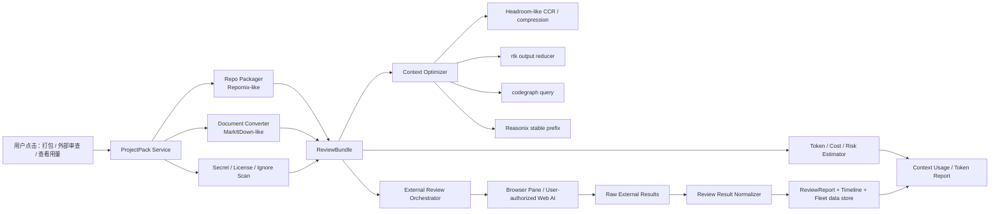
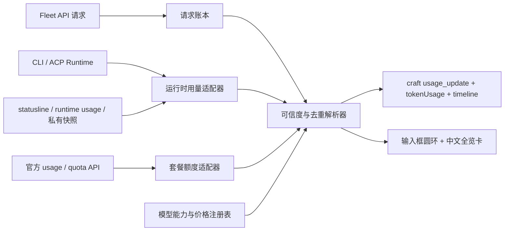

# 16 · 上下文效率 / 审查中心（一个中心，不是一堆散功能）

> 状态日期：2026-06-23
> 对应决策 **D9**（见 `docs/04-产品决策记录.md`）。是 `docs/01` 主干"上下文效率 / 审查中心"的展开。
> 目的：把"省 token、项目打包、格式转换、代码图谱、上下文压缩、token 用量可视化、外部 AI 多平台审查、成本/隐私提示"合成**一个统一的中心**，而不是 repomix/markitdown/codegraph/rtk/headroom/context-mode/外部审查七个散按钮。它是一条从输入整理 → 上下文压缩 → 用量可观测 → 外部审查 → 结果归档 → 成本报表的完整管线。
> 所有权：这条管线由**管理 Agent**（`docs/17`）统一驱动。项目 Agent 只"提出需求"和"消费报告"，不各自处理浏览器/登录态/打包/上传/隐私守门。

## 0 · 一个中心的统一管线

把七个来源理解成**一条管线的不同环节**，不是七个功能：

```
输入整理 ──▶ 上下文压缩 ──▶ 用量可观测 ──▶ 外部审查 ──▶ 归档/成本
repomix式打包    rtk 压输出       Usage/Token     用户授权登录态     ReviewReport
markitdown转换   codegraph 替整文件  真实/估算/未知    多平台提交        Fleet 数据目录
secret scan      Reasonix 稳定前缀   三色区分         每次外发权限卡     成本/隐私可审计
license/文件清单  headroom(可选)                      归一化合并
        │                                                  ▲
        └──────────── 管理 Agent 统一驱动（docs/17 第 5 节）──┘
```

一个入口、一条管线、一份成本账本。真实 token / 估算节省 / 外部平台成本必须分开标注；"网站不消耗 Fleet API token" ≠ "免费"。

## 1 · 结论

用户提出的方向是成立的，而且应该和已有几类“省 token”能力叠加，而不是二选一：

1. **Repomix / MarkItDown 输入整理层**
   - Repomix 负责把代码仓库打成 AI-friendly package，并提供 token count、ignore、secret 检查、压缩输出。
   - MarkItDown 负责把 PDF、Word、PPT、Excel、HTML、图片 OCR、音频等文件转成 Markdown，降低多格式附件直接进上下文的成本。
2. **Headroom / rtk / Reasonix / codegraph / context-mode 上下文效率层**
   - Headroom 学本地压缩、可逆检索、MCP/proxy、输出 token shaping。
   - rtk 负责命令输出压缩和 savings 可观测。
   - Reasonix 负责稳定前缀、planner/executor 分层、缓存友好上下文组织。
   - codegraph 负责用结构化代码图谱替代反复整文件读取。
   - context-mode 只黑盒学习 stats/statusline、沙箱工具、事件检索 UX。
   - LobeHub 只黑盒学习 context-engine、file-loaders、web-crawler、model/tool runtime 的产品分层：多格式输入先文档化，网页先提取正文，再进入统一上下文管线。
3. **外部 AI 网站审查层**
   - 一键把项目打包，按模板生成审查 prompt，让 Agent 在内置浏览器里提交给用户已登录、已授权的网站 AI。
   - 多平台并行审查后，Agent 自动下载/复制结果，归一化成一份可追踪的 `ReviewReport`。
   - 这可以节省 API token，也能借不同平台模型视角发现更多问题。
4. **成本和节省可观测层**
   - 像 Cursor / OpenCode / Claude Context Usage 一样显示上下文占比、输入/输出、缓存读写、工具调用、压缩前后、外部审查节省估算。
   - 真实数据和估算必须分开标注，不造假。

第一版不要做“全自动绕平台限制”。正确做法是：**用户授权登录，Agent 通过浏览器自动化提交，所有外发前展示数据包摘要、敏感信息扫描、目标平台、预计成本和可回滚记录**。

## 2 · 产品形态

### 2.1 顶部按钮：项目打包与审查

在 workspace / session 工具区增加一个可见入口：

- **打包当前项目**
  - 选择范围：当前 git repo、当前改动、指定目录、指定文件、最近会话相关文件。
  - 输出格式：Markdown、XML、plain text、zip。
  - 自动应用 `.gitignore`、`.repomixignore`、secret scan、二进制过滤。
  - 显示 token count、文件数、排除项、敏感信息风险。

- **提交外部审查**
  - 选择平台：ChatGPT Web、Claude Web、Gemini Web、Grok Web、Perplexity、DeepSeek Web、自定义网站。
  - 选择模板：架构审查、bug 风险、安全审查、性能审查、UI/UX 审查、设计工作流审查、许可证审查。
  - 先展示“将外发的内容摘要”，用户确认后再让 Agent 操作浏览器。
  - 支持多个平台并行或排队。

- **整理审查报告**
  - 把每个平台输出转为统一结构：findings、severity、file refs、evidence、disagreements、recommended fixes、confidence。
  - 去重、合并、标注冲突，最后生成超详细报告。
  - 保存到 session timeline 和 Fleet 数据目录，并能生成 follow-up task。

### 2.2 上下文用量 / Token 报告

当前 UI 已经出现上下文占比、token 明细、缓存 token、成本等雏形。Fleet 应把它升级成一等面板：

| 指标 | 真实/估算 | 来源 |
|---|---|---|
| input tokens / output tokens | 真实优先 | provider usage、ACP usage、craft session tokenUsage |
| cache read / cache creation | 真实优先 | provider usage；没有就不显示为真实命中 |
| context full percent | 估算或真实 | model context window + session usage |
| tool call tokens | 估算 | 工具输出进入 prompt 前的 token count |
| package tokens | 估算 | Repomix / tokenizer |
| compression savings | 实测或估算 | before/after token count |
| output savings | 估算需置信区间 | 类 Headroom 的 holdout/control 思路 |
| external review saved API cost | 估算 | 如果本应走 API，按模型价估算；网站“免费”只能标注为外部平台成本未知/用户账户承担 |

原则：**真实、估算、未知必须视觉区分**。不能把网站版本“不消耗 Fleet API token”说成“不消耗任何成本”。

#### 2.2.1 不重造终端已有的实时用量能力

Fleet 不为 Claude Code、Codex、OpenCode 等终端运行时重新估算它们已经提供的真实数据，而是为每种 runtime 建一个薄 `UsageAdapter`，把原生 usage 归一化后写入 craft 现有 `usage_update` / `tokenUsage` / session timeline。

- **Claude Code / Claude HUD**：优先读取 Claude Code 官方 statusline stdin 中的 `context_window.current_usage`、`context_window.context_window_size`、`rate_limits` 和原生 cost；HUD 的 transcript 解析和本地费用估算只能作降级来源。原生 stdin 始终优先。
- **Codex**：上下文数据来自当前 thread；账号模式读取运行时暴露的 context/rate-limit/credits 数据，API Key 模式读取 API usage 与标准 API 计费。`/status`、`/usage` 只说明底层已经具备这些数据，**Fleet 用户不需要输入命令**。两种模式不能混成同一费用口径。
- **OpenCode**：每个 assistant turn 保留 input/output/reasoning/cache read/cache write；上下文占用以最后一个有效 turn 的 token breakdown 除以当前 provider+model 的 context limit；session cost 单独累计。
- **ACP / 其它 CLI Runtime**：优先使用握手或事件中明确提供的 usage/capabilities；未提供时显示“未知”，不得用 `0` 冒充真实数据，也不得通过终端画面 OCR 读取数字。

数据优先级固定为：**运行时原生事件 > provider/API 原生 usage > runtime 导出的本地私有快照 > Fleet tokenizer 估算 > 未知**。每条数据都记录 `source`、`confidence`、`observedAt` 和 `authMode`。

#### 2.2.2 圆环、Token、会员额度和费用是四个不同指标

输入框附近沿用 Craft 原有 context 提示位置，先把一个紧凑圆环直接放在当前模型名之前；不另建常驻控制台。圆环在存在可信 context 数据时显示当前上下文占用，暂无数据时显示灰环和“暂无上下文用量”。后续点击圆环或模型选择器可打开完整详情卡，正常使用流程**不依赖任何斜杠命令**。

1. **圆环只表示当前上下文占用**：`currentContextTokens / effectiveContextWindow`。圆环不能表示账号额度或累计会话 token。
2. **会话 Token**：点击圆环后显示本次请求和会话累计的 input/output/reasoning/cache read/cache write。
3. **会员/订阅模式**：增加独立的`套餐用量`区，显示运行时真实返回的套餐名称、5 小时、7 天、日/周、模型桶或 credits 总额/已用/剩余及重置时间；不显示虚构美元费用，不把“包含在会员内”写成“免费”。
4. **API Key 模式**：显示真实 token；provider 返回 billed cost 时标“真实费用”，只有价格表可计算时标“估算费用”；provider、endpoint 或价格版本不明时显示“未知”。
5. **本地模型/自定义代理**：可显示上下文占用和 token；没有可信价格时不显示费用。

圆环阈值默认 `<70%` 正常、`70–85%` 警告、`>85%` 危险；实际百分比优先采用 runtime 原生值，因为某些运行时会为自动压缩预留缓冲区，不能总按模型标称窗口直接相除。

详情卡参考 Cursor/Codex 的“一次点击全览”，直接锚定在输入框上方，不跳转页面：

- 顶部：`上下文用量`、`已占用 70%`、`约 140K / 200K Token`、关闭按钮；
- 第一条：按分类着色的堆叠进度条；
- 明细：`系统提示词`、`工具定义`、`规则`、`技能`、`模型上下文协议（MCP）`、`子智能体定义`、`压缩后的对话`、`普通对话`；运行时无法提供某项真实拆分时标“估算”或“未知”，不伪造精确值；
- 用量：本次请求与会话累计的输入、输出、推理、缓存读、缓存写；
- 账号区：会员模式显示`套餐用量`，每个额度窗口一行进度条（例如`5 小时额度`、`每周·所有模型`），右侧显示已用比例与重置时间；API 模式显示余额/费用，本地/未知模式显示对应说明；
- 操作：`压缩上下文`、`查看详细报告`等操作可以存在，但详情查看本身不能要求执行命令。

所有用户可见字段默认使用中文。允许保留的英文仅限模型名、厂商名、API、MCP、Token 等无法准确替代或行业通用的技术名词；不得出现 `Context Usage`、`View Report`、`System prompt`、`Tool definitions`、`Rules`、`Skills`、`Subagent definitions`、`Summarized conversation`、`Conversation` 等未汉化界面文字。

第一版允许“总占用真实、分类拆分部分估算”，但必须逐行标注可信度。分类颜色只表示内容来源，不表示真实/估算；可信度使用独立文字或徽标，避免一套颜色承担两种语义。

#### 2.2.3 统一 usage 契约

后续共享协议只需要一套可扩展读模型，不为每个 runtime 新建 UI 字段：

```ts
type UsageTruth = 'actual' | 'estimated' | 'unknown'
type BillingMode = 'subscription' | 'api' | 'local' | 'external' | 'unknown'

interface RuntimeUsageSample {
  runtimeId: string
  providerId?: string
  modelId?: string
  authMode: BillingMode
  scope: 'turn' | 'session' | 'agent' | 'task' | 'workspace'
  context?: { used: number; limit: number; percent: number; truth: UsageTruth }
  tokens?: {
    input?: number
    output?: number
    reasoning?: number
    cacheRead?: number
    cacheWrite?: number
    truth: UsageTruth
  }
  subscription?: {
    planName?: string
    windows: Array<{
      name: string
      used?: number
      total?: number
      remaining?: number
      unit?: 'percent' | 'credits' | 'tokens' | 'requests' | 'currency'
      usedPercent?: number
      resetsAt?: string
      truth: UsageTruth
    }>
  }
  cost?: { amount: number; currency: string; truth: UsageTruth; pricingVersion?: string }
  source: string
  observedAt: string
}
```

`unknown` 字段保持缺省，不序列化成零。聚合时不得把 cache、reasoning 和 provider 已包含它们的 total 重复相加；provider 原生 total 优先于 Fleet 推导值。

#### 2.2.4 订阅总额度：借鉴 Cockpit Tools，不能照搬其账号接管方式

Cockpit Tools 的可取产品模式是：统一仪表盘、每个平台独立额度适配器、手动刷新 + 5–10 分钟定时刷新、缓存上次成功结果、同时显示额度和重置时间。CC Switch 的可取模式是：代理/API 请求进入统一 usage 日志，按真实上游模型和价格表统计请求、Token 与成本。两者负责不同问题：

- `QuotaAdapter`：Claude、Codex、Antigravity/Gemini、Grok 等订阅账号的套餐/额度窗口；
- `UsageAdapter`：API、代理和 CLI 会话产生的 input/output/reasoning/cache/cost；
- UI 可以放在同一张全览卡里，但数据不可互相推导或相加。

Fleet 不复制 Cockpit Tools/CC Switch 源码，也不采用自动切号、唤醒额度、私自读取浏览器 cookies、批量导入 token 或非公开接口。额度来源只允许：运行时主动提供、官方 CLI/statusline、公开官方 usage API、用户明确授权的 OAuth/API 查询、本地工具主动导出的私有快照。没有合法稳定来源就显示`平台未提供额度数据`。

| 平台 | 首选额度来源 | Fleet 显示 | 禁止做法 |
|---|---|---|---|
| Claude Code / Claude 订阅 | statusline stdin 的 `rate_limits`，或用户授权的官方运行时数据 | 套餐名（可得时）、5 小时/7 天窗口、已用比例、重置时间 | 不读取 Claude Web cookies，不调用未公开网页接口 |
| Codex / ChatGPT 订阅 | Codex 运行时暴露的 rate limits/credits/usage 快照 | 当前套餐、短周期/周周期额度、credits 与重置时间；只有比例时就只显示比例 | 不从 API Token 反推 ChatGPT 会员额度 |
| Antigravity / Gemini CLI | runtime/官方 quota summary 或用户授权 OAuth 查询 | 模型桶或日/周窗口、已用/剩余、重置时间 | 不注入/轮换账号，不触发“唤醒任务”消耗额度 |
| OpenCode | 当前 OpenCode provider 的 quota/usage；OpenCode 本身不是统一订阅额度来源 | 标明实际 provider，再展示该 provider 的套餐或 API 成本 | 不把不同 provider 的额度合成“OpenCode 总额度” |
| Grok / 其它 ACP CLI | ACP/runtime 明确提供的 quota capability 或官方公开查询 | 有什么显示什么；未提供则显示未知 | 不抓网页私有账户接口，不把未知写成无限 |
| API/中转服务 | provider balance/usage API + Fleet 请求日志 | 余额、Token、请求数、真实/估算费用 | 不和会员百分比混成一个总额度 |

刷新规则：打开全览卡时按需刷新；后台默认 5–10 分钟，失败时保留上次成功值并显示`更新于…`和错误原因；连续失败退避。刷新不得打断聊天，不得为了查额度发送模型请求。

当平台只给百分比时，“总额度”就是该平台定义的额度窗口，显示`已用 94%`而不是伪造 Token 总数；平台给 credits/requests/token/balance 时才显示具体总额和剩余值。不同单位绝不换算成一个虚假的全平台总数。

### 2.3 不同模型上下文与强度档位适配

Fleet 不根据模型名称猜上下文窗口或强度档位。选择器的数据单位是完整路由：`runtime/provider + endpoint + authMode + modelId`，而不是单独的 `modelId`。

CLI Runtime 场景同样如此：`cliRuntimeId` 只说明消息走哪个本机 CLI，`cliRuntimeModelId` / `CliRuntimeModelState` 才说明当前 ACP session 实际模型。输入框原模型选择器负责同时切 API 模型、CLI Runtime 和 CLI 暴露的动态模型；上下文圆环、套餐用量和费用详情必须读取这个“实际路由”，不能继续沿用 API `session.model`。

每条模型能力至少包含：

- `contextLimit`、`maxInputTokens`、`maxOutputTokens` 及来源；
- 是否支持 reasoning/thinking、支持哪些原生档位；
- 每个档位对应的 provider 请求参数；
- input/output/cache 的价格和大上下文阶梯价格；
- usage、会员额度和费用能否由当前接入方式真实返回。

能力来源优先级：**当前 runtime 握手/模型列表 > provider 官方模型元数据 > Fleet 缓存 catalog > 用户 override > unknown**。连接或模型切换后必须重新解析，不能继续沿用上一个模型的窗口和档位。

OpenCode 的可取做法是“模型注册表 + variant 请求覆盖”：模型拥有默认 request 和自己的 `variants[]`，variant 只是该模型请求参数的覆盖层；UI 只显示当前模型真实存在的 variant。协议层再把统一语义降为各 provider 参数：

| 厂商/协议 | 原生形态 | Fleet 处理 |
|---|---|---|
| OpenAI / OpenAI-compatible | `reasoning_effort` / Responses `reasoning.effort`，模型支持集合不同 | 只展示该模型声明支持的 `none/minimal/low/medium/high/xhigh` 等值；不支持的值发送前拒绝 |
| Anthropic | extended/adaptive thinking，常见为 `budgetTokens` 或 runtime 自身档位 | 优先保留 runtime 原生档位；若 Fleet 提供“低/中/高”友好名称，必须显式映射到该模型的预算且记录解析结果 |
| Gemini | `thinkingBudget` 或 provider 暴露的 thinking level | 使用该模型元数据，不假设和 OpenAI 档位等价 |
| ACP/CLI | initialize/session/model 能力或 runtime 文档 | 只传 runtime 明确接受的字段；未声明能力时只显示 `Auto` |
| 普通非推理模型 | 无 | 不显示强度选择器，不偷偷发送无效参数 |

UI 可以给用户一致的入口，但不能伪造一致能力：默认显示 `Auto`，其余选项来自当前模型的 `variants`。timeline 同时记录 `requestedVariant`、`resolvedProviderOptions`、能力来源和 fallback；如果 runtime 拒绝档位，返回可操作错误并保留原选择，不静默降级。

## 3 · 技术架构



### 3.1 ProjectPack Service

职责：

- 统一生成代码包、文档包、媒体说明包和 review prompt。
- 保留文件 hash、git commit、dirty diff、排除规则、secret scan 结果、license 风险。
- 支持 delta pack：只打包当前改动 + 依赖上下文，而不是每次全仓库。
- 支持 external pack：专门给外部网站 AI 的体积、格式和 prompt 模板。

参考：

- Repomix：仓库打包、token counting、ignore、secretlint、tree-sitter compression。
- MarkItDown：多格式文件转 Markdown，尤其是 PDF/PPT/Office/HTML/图片/音频。
- LobeHub：只黑盒参考 file-loaders / web-crawler / context pipeline 的分层，不复制实现；Fleet 的落点仍是 `ProjectPack -> ReviewBundle -> UsageReport / ReviewReport`。

### 3.2 Context Optimizer

组合策略：

| 技术 | 用在哪里 | 边界 |
|---|---|---|
| craft compaction | 长会话摘要 | 保持现有 session 真相，不另建会话 |
| Reasonix stable prefix | system/tools/project rules 稳定化 | 只迁绿灯范围；避免每轮打乱前缀 |
| rtk reducer | shell/test/log/git 输出压缩 | 用户显式启用；不自动改 shell hook |
| codegraph query | 用结构化查询替代整文件注入 | 本地索引可删除/重建 |
| Headroom CCR | 大输出、本地 RAG、会话历史可逆压缩 | 未绿灯前只黑盒参考；若接入优先外部 sidecar/MCP |
| context-mode UX | statusline / stats / doctor | ELv2，禁止复制源码或配置 |
| LobeHub context pipeline | 文件/网页/知识库先标准文档化，再进入上下文处理 | LobeHub Community License，高风险黑盒；只学产品分层，不复制源码/类型/结构 |

推荐顺序：

1. **先做可观测**：没有数据不要谈优化。
2. **再做 Repomix/MarkItDown package**：用户能看到包多大、发给谁。
3. **再做 rtk/codegraph/Reasonix**：这些已有绿灯，可真正减少本机上下文污染。
4. **Headroom 先做 sidecar 候选**：Apache-2.0 强候选，但未写入绿灯前不复制源码；可先黑盒验证 CLI/MCP 行为。

### 3.3 Fleet Runtime Usage Gateway（推荐实现）

Cockpit Tools 偏账号管理，额度查询与账号凭据/切换绑定较深；CC Switch 偏代理计量，只有经过代理的请求才能完整统计。Fleet 同时拥有 API 与 CLI Runtime，不应依赖其中任一方案，而应使用“事件推送 + 官方额度查询 + 本地请求账本”的混合结构。



#### A. 四本账，统一展示但不混算

| 账本 | 回答的问题 | 主要来源 | 能否跨平台相加 |
|---|---|---|---|
| 上下文账本 | 当前模型窗口用了多少 | 当前 turn/runtime 原生 context usage | 否，只看当前会话路由 |
| 会话 Token 账本 | 本次和累计消耗多少 Token | provider/ACP usage、Fleet API 请求 | 可按同一 token 语义汇总；未知项不参与 |
| 套餐额度账本 | 会员窗口还剩多少 | 官方 runtime/statusline/quota API | 否，不同平台和窗口分别显示 |
| 成本账本 | API/余额实际或估算花费多少 | provider billed cost、请求账本、价格快照 | 可按币种汇总，但必须区分真实/估算 |

优化节省（rtk、压缩、ProjectPack、cache）是附加对比指标，不计入上述四本账的“已用量”，避免重复扣减。

#### B. CLI Runtime 接法

每个 CLI adapter 可以声明以下独立能力，不能用一个 `supportsUsage` 布尔值糊在一起：

- `reportsContext`：能否给当前上下文 used/limit；
- `reportsTurnTokens`：能否给 input/output/reasoning/cache；
- `reportsSubscriptionQuota`：能否给套餐窗口和重置时间；
- `reportsCost`：能否给可信费用；
- `reportsModelCapabilities`：能否给模型窗口、输出上限和 variant。

数据优先从 ACP/session update 或 CLI 结构化事件推送。现有 HUD/statusline 只在它主动导出经过用户授权的本地私有快照时读取；不解析终端绘制文本、不 OCR 圆环、不偷偷读取浏览器登录态。Fleet 启动的 CLI 会话和外部独立终端会话必须分开：后者没有接入 telemetry 时显示`未接入统计`。

#### C. API 接法

Fleet 发出的每个 API 请求在现有 session/timeline 上附 usage：连接、provider、endpoint、实际模型、variant、input/output/reasoning/cache、provider total、billed cost。若 provider 只返回 Token，按带版本和生效时间的价格快照计算并标`估算费用`；若经过中转且实际上游模型不明，费用保持未知。

API 余额/预算通过独立 `QuotaAdapter` 查询，不从请求日志反推。用户在 Fleet 之外发出的 API 请求不在本地账本中，除非 provider 官方 usage API 能返回账号级统计。

#### D. 统一解析和去重

同一请求可能同时被 provider、CLI runtime 和代理报告。解析器使用稳定的 `requestId/runId/sessionId` 归并，并遵守：

1. provider billed usage 优先；
2. runtime 原生 usage 次之；
3. Fleet 请求账本用于补字段，不与前两者重复累计；
4. tokenizer/价格表只生成估算；
5. 缺少关联 id 时宁可并列标注来源，也不强行合并。

#### E. UI 一次点击看到全部

圆环仍只显示当前上下文。点击后的中文全览卡按固定顺序显示：

1. `上下文窗口`：当前模型 used/limit/percent + 分类堆叠条；
2. `本次会话`：输入/输出/推理/缓存/累计；
3. `套餐用量`：当前连接展开显示，Claude/Codex/Antigravity-Gemini/OpenCode 实际 provider/Grok 等其它已连接订阅以紧凑行继续列出；每行含图标、套餐、额度窗口、进度、重置时间、更新时间；
4. `API 与余额`：当前 API 连接的余额、真实/估算费用、价格来源；
5. `优化效果`：压缩、缓存、rtk、ProjectPack 的独立 before/after，不与套餐额度混算。

打开卡片不阻塞等待所有平台网络刷新：先显示缓存和`更新于…`，再异步刷新；单个平台失败只影响自己的行。用户可手动刷新单个平台，设置页可配置刷新间隔和关闭某个平台额度查询。

#### F. 与现有 Craft 代码的关系

- 当前实时上下文继续走已有 `usage_update`；
- session 汇总继续使用已有 `tokenUsage`，不建第二套 session 真相；
- 新的详细 breakdown/quota 作为 usage 事件的扩展读模型，由 Lead 冻结共享协议；
- UI 挂 `FreeFormInput.tsx` 原 context usage 区和原 Popover/Dropdown 体系；
- 全局额度缓存属于本机运行环境服务，默认 `LOCAL_ONLY`，只存非敏感统计和来源，不复制 token/cookie；
- 所有刷新、失败和费用来源对管理 Agent 提供只读结构化查询，Agent 不得自行登录、切号或触发消耗额度的“唤醒”。

### 3.4 External Review Orchestrator

外部网站审查必须是 agent-native：

- Agent 可以用内置浏览器打开用户已登录的网站。
- 选择网站、上传/粘贴内容、等待输出、复制/下载结果都进入 session timeline。
- 每次外发前弹出权限卡：目标网站、包大小、敏感信息扫描、文件列表摘要、登录 profile、预估成本/风险。
- 每个平台输出都保存原文、截图、URL、时间、账号 profile id、prompt hash 和 bundle hash。
- Agent 只整理用户授权拿到的结果，不抓取私有历史、不绕过反自动化、不规避额度/风控。

第一版只支持：

- 手动确认外发。
- 用户已登录的浏览器 profile。
- 文本粘贴或文件上传。
- 结果复制/下载。
- 失败可恢复：验证码、登录过期、上传失败、超上下文、平台拒绝。

不做：

- 不绕过平台限制。
- 不自动注册账号。
- 不读取或导出用户 cookies/token。
- 不把商业或隐私项目默认发到外部。
- 不把“网站不消耗 Fleet API token”宣传成“永久免费”。

## 4 · 插件内置方式：Optional Sidecar

用户说的“像插件一样内置，没它不影响使用，它更新也不影响我们”应该做成 **Optional Sidecar**：

| 类型 | 例子 | 机制 |
|---|---|---|
| 内置 adapter | Repomix packer、MarkItDown converter、Headroom MCP/proxy、OpenHands backend reference | Fleet 提供统一接口，具体工具可缺省 |
| 版本钉住 | `toolId + version + command + checksum` | 自动探测，但不强依赖 |
| 能力声明 | pack、convert、compress、review-submit、review-normalize | UI 根据 capability 显示按钮 |
| 沙箱/权限 | 本机文件、网络、浏览器、上传、写报告 | 全部走 permission + timeline |
| 更新隔离 | 工具升级不改 Fleet protocol | adapter 层兼容多个版本 |
| 降级路径 | 工具不存在时用 Fleet 简版实现或禁用按钮 | 不影响主聊天和 CLI Runtime |

这比把第三方库直接塞进主进程稳，也更符合许可证边界。

## 5 · OpenHands 的可用价值

OpenHands 不适合作为 Fleet 的单个 runtime mapping，但它很适合学习“解放双手”的产品系统：

- local / remote / cloud backend 切换。
- Agent Canvas 式长任务和自动化。
- Schedule / webhook / Slack / GitHub / Linear 等触发。
- 强制展示 sandbox 风险。
- 多 agent backend 不丢焦点。

Fleet 可吸收的方向：

- 把外部审查做成 automation：每天/每个 PR/每个里程碑自动打包并审查。
- 把长任务显示为可暂停、可恢复、可回放的 session card。
- 把“AI 网站审查”也当成一种 backend：不是模型 API，而是 browser-mediated review backend。

边界：

- OpenHands 主体 MIT，但 `enterprise/` 下是 PolyForm Free Trial；未写入绿灯前不复制源码。
- 不引入它的整个平台，不替代 craft SessionManager。
- 只学 backend 边界、sandbox 风险提示、自动化产品形态。

## 6 · 首版切片

| 切片 | 目标 | 主要文件区 |
|---|---|---|
| CTX-1 Usage Report | 统一展示 session token、cache、cost、context breakdown；真实/估算/未知分色 | `shared/protocol/*`、`server-core/services/usage-*`、renderer context panel |
| CTX-2 ProjectPack v1 | 打包当前项目/当前 diff，生成 token count、文件清单、secret scan、dry-run plan preview 和本地 review prompt；高危 secret 或外发禁用时阻断；不写 bundle、不外发 | `shared/protocol/project-pack.ts`、`server-core/services/project-pack-*`、`server-core/services/project-pack-review-prompt.ts`、`projectPack:previewPlan/pack/getSummary` |
| CTX-2.5 ContextCenter Overview | 聚合 Usage、Project Environment、context 工具、ProjectPack 和 review readiness；已输出带工具可用性、理由和 permission 边界的效率建议 | `shared/protocol/context-center.ts`、`server-core/services/context-center-service.ts`、`context-efficiency-advisor.ts` |
| CTX-2.6 Context / Review Center UI | 四段式 Context Efficiency 工作区 + bundle→job→report 审查中心；section empty/loading/error/ready；真实/估算/未知分色；人工粘贴归档 | `renderer/components/workbench/ContextEfficiencyPanel.tsx`、`ExternalReviewCenterPanel.tsx`、`renderer/lib/context-efficiency-ui.ts` |
| CTX-2.7 External Review Manual Flow | bundle → 生成 review prompt → 手动复制 → 粘贴保存 report；同 bundleId 多平台归档；Fleet token / 外部成本 / token 估算三口径分开展示；Job 可选 | `ExternalReviewCenterPanel.tsx`、`renderer/lib/external-review-manual-flow.ts`、`projectPack:buildReviewPrompt`、`externalReview:*` |
| CTX-3 文档转换 | Craft 基座已内置 MarkItDown JS/命令脚本和文件读取接线；现已登记到 System Tools，不再重复开发 sidecar | `files.ts`、`resources/scripts/markitdown_cli.py`、`system-tools-registry.ts` |
| CTX-4 外部审查报告 | 原始输出、findings、bundle hash、平台、Fleet token 与外部成本分开归档；手动粘贴原文会保守抽取 severity/path/line/evidence/recommendation，识别不了则只保留原文；job 完成时本地保存 report 并回填 `reportId`；提供 LOCAL_ONLY RPC | `shared/protocol/external-review.ts`、`external-review-report.ts`、`external-review-completion-service.ts`、`externalReview:*` / `externalReviewJob:*` |
| CTX-4 External Review v1 | 用户确认后在 browser pane 提交一个平台，回收结果，生成 `ReviewReport` | browser pane、session timeline、Fleet 数据目录 |
| CTX-5 Multi-platform Review | 多平台排队/并行；本地 report service 已提供 bundle summary，按文件/行号/标题保守归并重复 finding，按最高严重度排序；后续 UI 做冲突标注和人工确认 | `externalReview:summarizeBundle`、`summarizeExternalReviewReports` |
| CTX-6 Optimizer v1 | 接 rtk/codegraph/Reasonix 已绿灯能力；Headroom 先做 sidecar smoke | local-only services / optional sidecars |

## 7 · 成功标准

- 用户能点一次“打包当前项目”，看到文件数、token 数、敏感信息风险、输出格式和可外发摘要。
- 用户能点一次“提交外部审查”，Agent 在内置浏览器完成一次用户授权网站审查，并把结果整理成报告。
- 报告包含来源平台、原始输出、归一化 findings、冲突观点、建议修复、证据和后续任务。
- Context Usage 面板能显示当前会话 token/cost/cache，并标明真实或估算。
- 每个优化器显示 before/after、节省百分比、失败原因和是否影响答案质量。
- 没有任何第三方工具时，Fleet 仍能正常运行；按钮显示缺少 sidecar 或使用简化实现。

## 8 · 风险

- **隐私泄漏**：外发前必须有摘要和确认；默认不外发 `.env`、密钥、客户数据、私有大文件。
- **平台 ToS**：只使用用户授权账号和正常 Web UI/API，不绕过限制。
- **幻觉审查**：多平台报告必须保留原文和证据，不能只给合成结论。
- **虚假省 token**：真实和估算分开；外部网站节省的是 Fleet API token，不等于无成本。
- **工具漂移**：所有第三方工具先走 optional sidecar，接口稳定后再考虑绿灯迁移。
- **许可证误判**：Repomix/MarkItDown/OpenHands/Headroom 虽有宽松部分，未写入绿灯前不复制源码；OpenHands enterprise 目录有 PolyForm 限制。
