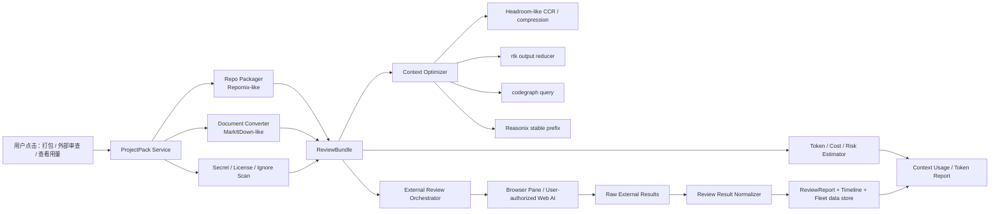

# 16 · 上下文效率 / 审查中心（一个中心，不是一堆散功能）

> 状态日期：2026-06-21
> 对应决策 **D9**（见 `docs/04-产品决策记录.md`）。是 `docs/01` 主干"上下文效率 / 审查中心"的展开。
> 目的：把"省 token、项目打包、格式转换、代码图谱、上下文压缩、token 用量可视化、外部 AI 多平台审查、成本/隐私提示"合成**一个统一的中心**，而不是 repomix/markitdown/codegraph/rtk/headroom/context-mode/外部审查七个散按钮。它是一条从输入整理 → 上下文压缩 → 用量可观测 → 外部审查 → 结果归档 → 成本报表的完整管线。
> 所有权：这条管线由**管理 Agent**（`docs/17`）统一驱动。项目 Agent 只"提出需求"和"消费报告"，不各自处理浏览器/登录态/打包/上传/隐私守门。

## 0 · 一个中心的统一管线

把七个来源理解成**一条管线的不同环节**，不是七个功能：

```
输入整理 ──▶ 上下文压缩 ──▶ 用量可观测 ──▶ 外部审查 ──▶ 归档/成本
repomix式打包    rtk 压输出       Usage/Token     用户授权登录态     ReviewReport
markitdown转换   codegraph 替整文件  真实/估算/未知    多平台提交        Fleet 数据目录
secret scan      Reasonix 稳定前缀   三色区分         每次外发权限卡     成本/隐私可审计
license/文件清单  headroom(可选)                      归一化合并
        │                                                  ▲
        └──────────── 管理 Agent 统一驱动（docs/17 第 5 节）──┘
```

一个入口、一条管线、一份成本账本。真实 token / 估算节省 / 外部平台成本必须分开标注；"网站不消耗 Fleet API token" ≠ "免费"。

## 1 · 结论

用户提出的方向是成立的，而且应该和已有几类“省 token”能力叠加，而不是二选一：

1. **Repomix / MarkItDown 输入整理层**
   - Repomix 负责把代码仓库打成 AI-friendly package，并提供 token count、ignore、secret 检查、压缩输出。
   - MarkItDown 负责把 PDF、Word、PPT、Excel、HTML、图片 OCR、音频等文件转成 Markdown，降低多格式附件直接进上下文的成本。
2. **Headroom / rtk / Reasonix / codegraph / context-mode 上下文效率层**
   - Headroom 学本地压缩、可逆检索、MCP/proxy、输出 token shaping。
   - rtk 负责命令输出压缩和 savings 可观测。
   - Reasonix 负责稳定前缀、planner/executor 分层、缓存友好上下文组织。
   - codegraph 负责用结构化代码图谱替代反复整文件读取。
   - context-mode 只黑盒学习 stats/statusline、沙箱工具、事件检索 UX。
   - LobeHub 只黑盒学习 context-engine、file-loaders、web-crawler、model/tool runtime 的产品分层：多格式输入先文档化，网页先提取正文，再进入统一上下文管线。
3. **外部 AI 网站审查层**
   - 一键把项目打包，按模板生成审查 prompt，让 Agent 在内置浏览器里提交给用户已登录、已授权的网站 AI。
   - 多平台并行审查后，Agent 自动下载/复制结果，归一化成一份可追踪的 `ReviewReport`。
   - 这可以节省 API token，也能借不同平台模型视角发现更多问题。
4. **成本和节省可观测层**
   - 像 Cursor / OpenCode / Claude Context Usage 一样显示上下文占比、输入/输出、缓存读写、工具调用、压缩前后、外部审查节省估算。
   - 真实数据和估算必须分开标注，不造假。

第一版不要做“全自动绕平台限制”。正确做法是：**用户授权登录，Agent 通过浏览器自动化提交，所有外发前展示数据包摘要、敏感信息扫描、目标平台、预计成本和可回滚记录**。

## 2 · 产品形态

### 2.1 顶部按钮：项目打包与审查

在 workspace / session 工具区增加一个可见入口：

- **打包当前项目**
  - 选择范围：当前 git repo、当前改动、指定目录、指定文件、最近会话相关文件。
  - 输出格式：Markdown、XML、plain text、zip。
  - 自动应用 `.gitignore`、`.repomixignore`、secret scan、二进制过滤。
  - 显示 token count、文件数、排除项、敏感信息风险。

- **提交外部审查**
  - 选择平台：ChatGPT Web、Claude Web、Gemini Web、Grok Web、Perplexity、DeepSeek Web、自定义网站。
  - 选择模板：架构审查、bug 风险、安全审查、性能审查、UI/UX 审查、设计工作流审查、许可证审查。
  - 先展示“将外发的内容摘要”，用户确认后再让 Agent 操作浏览器。
  - 支持多个平台并行或排队。

- **整理审查报告**
  - 把每个平台输出转为统一结构：findings、severity、file refs、evidence、disagreements、recommended fixes、confidence。
  - 去重、合并、标注冲突，最后生成超详细报告。
  - 保存到 session timeline 和 Fleet 数据目录，并能生成 follow-up task。

### 2.2 Context Usage / Token Report

当前 UI 已经出现上下文占比、token 明细、缓存 token、成本等雏形。Fleet 应把它升级成一等面板：

| 指标 | 真实/估算 | 来源 |
|---|---|---|
| input tokens / output tokens | 真实优先 | provider usage、ACP usage、craft session tokenUsage |
| cache read / cache creation | 真实优先 | provider usage；没有就不显示为真实命中 |
| context full percent | 估算或真实 | model context window + session usage |
| tool call tokens | 估算 | 工具输出进入 prompt 前的 token count |
| package tokens | 估算 | Repomix / tokenizer |
| compression savings | 实测或估算 | before/after token count |
| output savings | 估算需置信区间 | 类 Headroom 的 holdout/control 思路 |
| external review saved API cost | 估算 | 如果本应走 API，按模型价估算；网站“免费”只能标注为外部平台成本未知/用户账户承担 |

原则：**真实、估算、未知必须视觉区分**。不能把网站版本“不消耗 Fleet API token”说成“不消耗任何成本”。

## 3 · 技术架构



### 3.1 ProjectPack Service

职责：

- 统一生成代码包、文档包、媒体说明包和 review prompt。
- 保留文件 hash、git commit、dirty diff、排除规则、secret scan 结果、license 风险。
- 支持 delta pack：只打包当前改动 + 依赖上下文，而不是每次全仓库。
- 支持 external pack：专门给外部网站 AI 的体积、格式和 prompt 模板。

参考：

- Repomix：仓库打包、token counting、ignore、secretlint、tree-sitter compression。
- MarkItDown：多格式文件转 Markdown，尤其是 PDF/PPT/Office/HTML/图片/音频。
- LobeHub：只黑盒参考 file-loaders / web-crawler / context pipeline 的分层，不复制实现；Fleet 的落点仍是 `ProjectPack -> ReviewBundle -> UsageReport / ReviewReport`。

### 3.2 Context Optimizer

组合策略：

| 技术 | 用在哪里 | 边界 |
|---|---|---|
| craft compaction | 长会话摘要 | 保持现有 session 真相，不另建会话 |
| Reasonix stable prefix | system/tools/project rules 稳定化 | 只迁绿灯范围；避免每轮打乱前缀 |
| rtk reducer | shell/test/log/git 输出压缩 | 用户显式启用；不自动改 shell hook |
| codegraph query | 用结构化查询替代整文件注入 | 本地索引可删除/重建 |
| Headroom CCR | 大输出、本地 RAG、会话历史可逆压缩 | 未绿灯前只黑盒参考；若接入优先外部 sidecar/MCP |
| context-mode UX | statusline / stats / doctor | ELv2，禁止复制源码或配置 |
| LobeHub context pipeline | 文件/网页/知识库先标准文档化，再进入上下文处理 | LobeHub Community License，高风险黑盒；只学产品分层，不复制源码/类型/结构 |

推荐顺序：

1. **先做可观测**：没有数据不要谈优化。
2. **再做 Repomix/MarkItDown package**：用户能看到包多大、发给谁。
3. **再做 rtk/codegraph/Reasonix**：这些已有绿灯，可真正减少本机上下文污染。
4. **Headroom 先做 sidecar 候选**：Apache-2.0 强候选，但未写入绿灯前不复制源码；可先黑盒验证 CLI/MCP 行为。

### 3.3 External Review Orchestrator

外部网站审查必须是 agent-native：

- Agent 可以用内置浏览器打开用户已登录的网站。
- 选择网站、上传/粘贴内容、等待输出、复制/下载结果都进入 session timeline。
- 每次外发前弹出权限卡：目标网站、包大小、敏感信息扫描、文件列表摘要、登录 profile、预估成本/风险。
- 每个平台输出都保存原文、截图、URL、时间、账号 profile id、prompt hash 和 bundle hash。
- Agent 只整理用户授权拿到的结果，不抓取私有历史、不绕过反自动化、不规避额度/风控。

第一版只支持：

- 手动确认外发。
- 用户已登录的浏览器 profile。
- 文本粘贴或文件上传。
- 结果复制/下载。
- 失败可恢复：验证码、登录过期、上传失败、超上下文、平台拒绝。

不做：

- 不绕过平台限制。
- 不自动注册账号。
- 不读取或导出用户 cookies/token。
- 不把商业或隐私项目默认发到外部。
- 不把“网站不消耗 Fleet API token”宣传成“永久免费”。

## 4 · 插件内置方式：Optional Sidecar

用户说的“像插件一样内置，没它不影响使用，它更新也不影响我们”应该做成 **Optional Sidecar**：

| 类型 | 例子 | 机制 |
|---|---|---|
| 内置 adapter | Repomix packer、MarkItDown converter、Headroom MCP/proxy、OpenHands backend reference | Fleet 提供统一接口，具体工具可缺省 |
| 版本钉住 | `toolId + version + command + checksum` | 自动探测，但不强依赖 |
| 能力声明 | pack、convert、compress、review-submit、review-normalize | UI 根据 capability 显示按钮 |
| 沙箱/权限 | 本机文件、网络、浏览器、上传、写报告 | 全部走 permission + timeline |
| 更新隔离 | 工具升级不改 Fleet protocol | adapter 层兼容多个版本 |
| 降级路径 | 工具不存在时用 Fleet 简版实现或禁用按钮 | 不影响主聊天和 CLI Runtime |

这比把第三方库直接塞进主进程稳，也更符合许可证边界。

## 5 · OpenHands 的可用价值

OpenHands 不适合作为 Fleet 的单个 runtime mapping，但它很适合学习“解放双手”的产品系统：

- local / remote / cloud backend 切换。
- Agent Canvas 式长任务和自动化。
- Schedule / webhook / Slack / GitHub / Linear 等触发。
- 强制展示 sandbox 风险。
- 多 agent backend 不丢焦点。

Fleet 可吸收的方向：

- 把外部审查做成 automation：每天/每个 PR/每个里程碑自动打包并审查。
- 把长任务显示为可暂停、可恢复、可回放的 session card。
- 把“AI 网站审查”也当成一种 backend：不是模型 API，而是 browser-mediated review backend。

边界：

- OpenHands 主体 MIT，但 `enterprise/` 下是 PolyForm Free Trial；未写入绿灯前不复制源码。
- 不引入它的整个平台，不替代 craft SessionManager。
- 只学 backend 边界、sandbox 风险提示、自动化产品形态。

## 6 · 首版切片

| 切片 | 目标 | 主要文件区 |
|---|---|---|
| CTX-1 Usage Report | 统一展示 session token、cache、cost、context breakdown；真实/估算/未知分色 | `shared/protocol/*`、`server-core/services/usage-*`、renderer context panel |
| CTX-2 ProjectPack v1 | 打包当前项目/当前 diff，生成 token count、文件清单、secret scan、dry-run plan preview 和本地 review prompt；高危 secret 或外发禁用时阻断；不写 bundle、不外发 | `shared/protocol/project-pack.ts`、`server-core/services/project-pack-*`、`server-core/services/project-pack-review-prompt.ts`、`projectPack:previewPlan/pack/getSummary` |
| CTX-2.5 ContextCenter Overview | 聚合 Usage、Project Environment、context 工具、ProjectPack 和 review readiness；已输出带工具可用性、理由和 permission 边界的效率建议 | `shared/protocol/context-center.ts`、`server-core/services/context-center-service.ts`、`context-efficiency-advisor.ts` |
| CTX-2.6 Context / Review Center UI | 四段式 Context Efficiency 工作区 + bundle→job→report 审查中心；section empty/loading/error/ready；真实/估算/未知分色；人工粘贴归档 | `renderer/components/workbench/ContextEfficiencyPanel.tsx`、`ExternalReviewCenterPanel.tsx`、`renderer/lib/context-efficiency-ui.ts` |
| CTX-3 文档转换 | Craft 基座已内置 MarkItDown JS/命令脚本和文件读取接线；现已登记到 System Tools，不再重复开发 sidecar | `files.ts`、`resources/scripts/markitdown_cli.py`、`system-tools-registry.ts` |
| CTX-4 外部审查报告 | 原始输出、findings、bundle hash、平台、Fleet token 与外部成本分开归档；job 完成时本地保存 report 并回填 `reportId`；提供 LOCAL_ONLY RPC | `shared/protocol/external-review.ts`、`external-review-report.ts`、`external-review-completion-service.ts`、`externalReview:*` / `externalReviewJob:*` |
| CTX-4 External Review v1 | 用户确认后在 browser pane 提交一个平台，回收结果，生成 `ReviewReport` | browser pane、session timeline、Fleet 数据目录 |
| CTX-5 Multi-platform Review | 多平台排队/并行，结果去重、冲突合并、严重度排序 | review normalizer / report service |
| CTX-6 Optimizer v1 | 接 rtk/codegraph/Reasonix 已绿灯能力；Headroom 先做 sidecar smoke | local-only services / optional sidecars |

## 7 · 成功标准

- 用户能点一次“打包当前项目”，看到文件数、token 数、敏感信息风险、输出格式和可外发摘要。
- 用户能点一次“提交外部审查”，Agent 在内置浏览器完成一次用户授权网站审查，并把结果整理成报告。
- 报告包含来源平台、原始输出、归一化 findings、冲突观点、建议修复、证据和后续任务。
- Context Usage 面板能显示当前会话 token/cost/cache，并标明真实或估算。
- 每个优化器显示 before/after、节省百分比、失败原因和是否影响答案质量。
- 没有任何第三方工具时，Fleet 仍能正常运行；按钮显示缺少 sidecar 或使用简化实现。

## 8 · 风险

- **隐私泄漏**：外发前必须有摘要和确认；默认不外发 `.env`、密钥、客户数据、私有大文件。
- **平台 ToS**：只使用用户授权账号和正常 Web UI/API，不绕过限制。
- **幻觉审查**：多平台报告必须保留原文和证据，不能只给合成结论。
- **虚假省 token**：真实和估算分开；外部网站节省的是 Fleet API token，不等于无成本。
- **工具漂移**：所有第三方工具先走 optional sidecar，接口稳定后再考虑绿灯迁移。
- **许可证误判**：Repomix/MarkItDown/OpenHands/Headroom 虽有宽松部分，未写入绿灯前不复制源码；OpenHands enterprise 目录有 PolyForm 限制。
