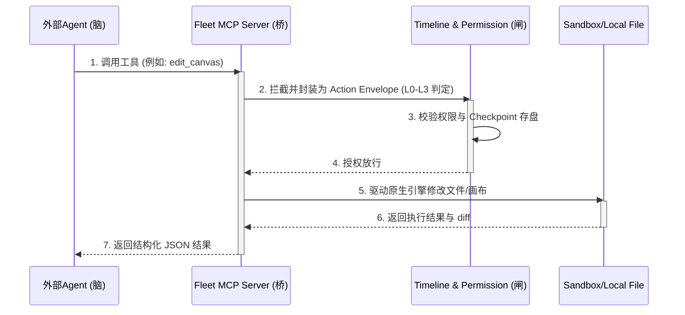

# 42 · 系统路线与最终落地路径框架（三层接入与双层 Agent 隔离指南）

> 状态日期：2026-06-26
> 用途：作为 Fleet 项目在架构与路线上的最高指导文件。它系统性地总结了我们在防过度工程化、本地 CLI 借力、多 Agent 编排、长程自动化、管理 Agent 与项目队长解耦等关键决策上的深度思考，并给用了唯一的落地框架。
> 效力：本文件为项目路线的终极真相，后续所有实现 Agent 均须无条件遵守本文确立的解耦和隔离设计原则。

---

## 1 · 核心原则：Spine-Core-Sandbox (SCS) 混合架构

为了同时实现“在软件内做全流程自动化”与“安全且可回放地操控本地电脑”，Fleet 拒绝“重造轮子自研本地代码 Agent”，也拒绝“直接魔改外部 CLI 管理器”。我们采用 **Spine-Core-Sandbox (SCS)** 三层混合架构：

```
  ┌────────────────────────────────────────────────────────┐
  │          【Spine 前台控制脊柱】 (保持 Craft 原设计)       │
  │  - 统一的 Timeline 会话展示, Permission 门, Labels 身份   │
  │  - Canvas/网页/视频原生引擎事件 -> SessionEvent          │
  └───────────────────────────┬────────────────────────────┘
                              │ Local RPC / IPC WebSocket
                              ▼
  ┌────────────────────────────────────────────────────────┐
  │           【Core 后端常驻 Daemon 守护进程】              │
  │  - 独立于 Electron GUI 生命周期运行 (支持休眠/脱机)     │
  │  - 负责长程任务状态机管理, Checkpoint 快照与事务回滚     │
  └───────────────────────────┬────────────────────────────┘
                              │ 
                              ▼ [工作区沙箱隔离]
  ┌────────────────────────────────────────────────────────┐
  │              【Sandbox 进程与工作区沙箱】               │
  │  - 本地 PTY 终端通道 (Tauri/Electron xterm)             │
  │  - 物理隔离的任务目录 (如 ~/fleet_workspaces/task_123)  │
  │  - 外部 CLI (Goose/Claude Code) 以 Stdio ACP/MCP 挂载   │
  └────────────────────────────────────────────────────────┘
```

1. **前台 Spine（保持原设计）**：保留 Craft 的单 Session/Timeline 界面、输入框设计和 Labels 身份。所有的矢量画布操作、网页标注、视频剪辑原生事件，通过瘦桥（Bridge）映射成 `SessionEvent` 流向 Timeline，确保“人机共编”和一键撤销（Undo）。
2. **后端 Core（常驻守护进程）**：在本地起一个常驻本机的 Daemon 守护服务，使长程自动化即使在 Electron 窗口关闭或系统休眠时，仍能在后台默默拉起 PTY 跑命令、写日志、分析代码。
3. **运行层 Sandbox（工作区沙箱与 PTY 管道）**：
   - **工作目录隔离**：为不同子任务创建物理隔离的工作目录（如 `~/fleet_workspaces/task-123`），开发和剪辑在不同目录下操作，避免多 Agent 协作时发生 Git 文件踩脚和覆盖灾难。
   - **PTY 终端通道**：使用 `xterm.js` 在前端渲染 PTY。连接本地外部 CLI（Goose, Claude Code）直接建立 stdio 管道，用户可在 PTY 中进行交互式 `Y/N` 干预。

### 1.1 · Spine 与 Core Daemon 的握手与断线同步协议
为了保证 GUI 界面（Spine）关闭后，后台（Core）的自动化任务不受影响，并且在 GUI 重新打开时能平滑恢复状态，两者之间采用 **本地 IPC WebSocket** 进行实时状态同步。

* **心跳与连接**：GUI 启动时，自动向 `localhost:<port>` 发起握手请求。
* **重连状态拉取**：握手成功后，GUI 发送 `sync/request` 指令，Daemon 响应当前正在执行的长程任务树与 Timeline 事件增量：

```json
{
  "jsonrpc": "2.0",
  "method": "sync/restore",
  "params": {
    "activeTasks": [
      {
        "taskId": "task_123",
        "status": "in_progress",
        "assigneeSessionId": "session_g01",
        "currentStepIndex": 4
      }
    ],
    "timelineEventsDelta": [
      {
        "eventId": "evt_998",
        "type": "team_task_assigned",
        "timestamp": 1719347520000,
        "payload": { "taskId": "task_123" }
      }
    ]
  }
}
```

---

## 2 · Brain-Bridge-Gate（脑-桥-闸）三层 Agent 接入

外部或本地 Agent 在 Fleet 中以标准的**“三层接口”**接入，兼顾其原生智商与软件内的协作生态：



* **脑 (Brain)**：通过 Stdio ACP 协议直接拉起本地安装好的 `Claude Code` 或 `Goose` 进程。**白嫖大厂最聪明的代码理解和 PTY 驾驭能力**，不在 Electron 内部重复发明写代码的轮子。
* **桥 (Bridge)**：Fleet 本地起一个 MCP (Model Context Protocol) 服务端点。将 Fleet 的 [Internal Action Registry](file:///Users/lullwen/Documents/GUI%20%E7%BB%88%E7%AB%AF/docs/40-Internal-Action-Registry-%E8%A7%84%E6%A0%BC%E4%B8%8E%E6%A0%B7%E6%9D%BF%E9%97%AD%E7%8E%AF.md)（如画画布、操作资产）封装为一组标准的 MCP Tools 暴露出去。Agent 想要在软件内画图或剪辑，统一调用这些 MCP 工具。
* **闸 (Gate)**：所有的微观命令（如 `terminal.run_command`）和软件修改，都统一拦截并包装成 Action 信封。提交给 Permission 门进行 L0-L3 判定，并记录 `SessionEvent` 作为长程任务的恢复依据。

---

## 3 · 双层 Agent 隔离分流（管理 Agent vs 队长 Agent）

管理 Agent 和项目队长 Agent 职责不同、生命周期不同，必须在物理和上下文上彻底隔离：

### 🤵 管理 Agent (manager:global) —— “公司全局管家”
* **生命周期**：全局唯一，长期运行，随应用启动常驻，不随 Workspace 销毁。
* **位置**：位于全局“所有会话”侧边栏的专属聊天入口，不在具体的项目会话内。
* **核心职责**：
  * **懂人**：读取全局分层记忆（长期偏好、授权习惯），沉淀用户的质量标准。
  * **懂软件**：读取 Internal Action Registry 的静态元数据大图（Metadata Catalog），知道系统有哪些模块和能力。
  * **安全与代答**：负责把关队长提交的“项目大报告”。代替人自动代答 L0/L1 低风险权限，向人推送 L2/L3 关键审查卡片。
  * **不碰细节**：**它没有写代码、剪辑、跑终端的具体工具**。它不插手项目细节，只做宏观指派和最终质检验收。

### 👷 队长 Agent (Leader Agent) —— “项目工头 (PM)”
* **生命周期**：项目级唯一（Workspace-scoped），随工作区打开而实例化，随项目关闭而销毁。
* **位置**：常驻当前项目 Workspace 的主群聊会话（`teamConversationSessionId`）。
* **核心职责**：
  * **懂项目**：懂具体项目的业务规则（`team.rules.json`）和代码结构。
  * **微观编排**：把管理 Agent 分发的大目标，拆解成开发、测试、剪辑等小任务，指派给项目内物理隔离的队员（G-01, G-02）。
  * **第一轮质检**：收集队员的 `report`，合并代码并测试，提炼成一份“项目阶段性报告”提交给管理 Agent。
  * **不越权**：无法跨项目，接触不到用户的全局长期隐私或设置。

### 3.1 · 管理 Agent 与 队长 Agent 交互的 RPC 契约
当管理 Agent 拆解任务后，它通过以下 **JSON-RPC** 协议将任务异步投递（Handoff）到对应项目的队长会话中：

```json
{
  "jsonrpc": "2.0",
  "method": "team/assign_project_task",
  "params": {
    "teamId": "team_workspace_a",
    "taskId": "task_proj_001",
    "title": "React 19 Upgrade & Demo Video Edit",
    "delivery": "queued",
    "autoRun": false,
    "contextSummary": {
      "userPreferencesExcerpt": "Preferred styling is vanilla CSS, maximum animations."
    }
  }
}
```
* **注意**：`autoRun: false` 表示任务处于 L1 挂起投递状态，只进入队长会话的收件箱；只有当被触发为 `autoRun: true` 时才正式 dispatch 执行，以此防范未授权的本地环境变动。

---

## 4 · 长程自动化中“上下文与工具”的极简剪裁

为了防止长程运行中多 Agent 消息刷屏、上下文爆炸和工具混淆，必须采用以下两层剪裁机制：

### 1. 动态工具与上下文剪裁（Identity Label 驱动）
* **工具裁剪**：当拉起某个具有 `Identity Label`（如 `video_editor`）的队员 Session 时，Fleet 在底层根据标签过滤 `InternalActionRegistry`，**仅向该 Agent 挂载其身份匹配 of 3-4 个精细 Tools**。它绝对看不到 `terminal.run_command`。
* **上下文裁剪**：在构建 Agent 的对话上下文时，只注入与其任务直接相关的文件描述（如剪辑时间线 JSON 和媒体资产），不注入无关的代码 codegraph 索引。
* **效果**：保持子 Agent 的上下文足迹极低（< 5k tokens），免于工具混淆，精度高达 99%。

### 2. 历史轨迹压缩 (Trajectory Compression)
* **触发条件与滑动窗口**：
  在长程自动化的执行循环中，系统旁路订阅子 Agent 会话的消息轮数与 Action 调用状态。一旦满足以下任一条件，即触发轨迹压缩：
  1. **同一动作连续报错**：同一个 Internal Action 调用（例如 `terminal.run_command`）连续报错并重试次数达到 **3 次**。
  2. **上下文过载警戒线**：单会话消耗的 Token 占到模型最大上下文窗口的 **70%**。
* **压缩动作**：
  调用一次轻量 LLM 将前 5-10 轮的“修改-报错”历史进行**摘要压缩**，提炼成“已尝试修改 X 属性，但发生 Y 错误，此路不通”的短记录。
  **彻底删除这 5-10 轮的原始代码 diff 和冗余日志**，只把该总结带入下一轮。这在物理上断绝了上下文塞满的风险，确保长程运行的智力保真。

### 4.1 · Checkpoint 事务与断点恢复的数据结构
为了保证长程自动化能在中途崩溃后精准恢复，Daemon 在子 Agent 每次成功执行一个 L2/L3 级写 Action 后，会在本地隔离目录下自动打一个快照：

```json
{
  "checkpointId": "chk_1719347520",
  "taskId": "task_123",
  "timestamp": 1719347520000,
  "gitCommitHash": "8f3b2d1c5a7f9e8d",
  "state": {
    "currentStepIndex": 3,
    "variables": {
      "reactVersionDetected": "18.3.0",
      "sandboxUrl": "http://localhost:5173"
    },
    "completedActionsLog": [
      "files.read_file",
      "files.edit_file",
      "terminal.run_command"
    ]
  }
}
```
* **恢复逻辑**：若 Daemon 异常退出并重启，读取该 Checkpoint，首先执行 `git reset --hard 8f3b2d1c5a7f9e8d` 恢复物理文件状态，然后将 `state` 重新注入到 Agent 的 Context Mailbox 中，使 Agent 从 `currentStepIndex: 3` 直接继续向下执行。

---

## 5 · 商业化会员的最轻量闭环：BYOK + 统一代购网关

Fleet 不在本地客户端做繁重的登录计费和多租户凭据池，学 Hermes，采用极其干净的双轨制：

* **极客免费模式 (BYOK)**：客户端开源免费。支持用户填自己的大模型 API Key（OpenAI, Anthropic 等），支持自动扫描检测并测试本地安装好的 CLI（`Goose`, `Claude Code`），供极客在本地安全自用。
* **一站式会员订阅 (Fleet Portal)**：用户付一份固定月费订阅官方 Portal，仅需 OAuth 单点登录客户端。
  * 所有的云端超强模型 API 路由、网页搜索（Firecrawl）、AI 重型外发 Job（如视频渲染、生图、图转 3D）、以及 headless 云浏览器实例，**全部由 Portal 在云端统一包销和路由结算**。用户省去了到处配置 Key 和额度对账的烦恼。

---

## 6 · 落地演进路线 (M0 - M3)

```
 M0: 协作与工具脊柱  ──►  M1: 创作面与 Sandbox 接入  ──►  M2: 媒体主线  ──►  M3: 外部 Portal 与高级能力
 [Internal Action]       [openpencil画布瘦桥对接]         [视频剪辑]       [多账号Profile / 订阅网关]
 [files 样板与 registry] [物理隔离沙箱工作区]              [媒体资产库]     [云端 Job 离线托管]
```

### M0 · 协作与工具脊柱
1. **Internal Action Registry + `files` 样板闭环**：当前分支的核心代码已落，完成人工视觉点验并升 `docs/32` 状态（✅）。
2. **注册表覆盖**：将只读 files、team、progress、status、labels、memory、browser selection 注册进 actions，实现“写动作全覆盖，无注册不可写”。
3. **团队协议 Spine 落地**：完成 `docs/33` 前端渲染接线。

### M1 · 创作面与 Sandbox 接入
1. **工作区 Sandbox 隔离**：在 Daemon 后端落地 `~/fleet_workspaces` 任务临时隔离文件夹，以及 PTY 命令运行机制。
2. **设计画布 openpencil 瘦桥对接**：在获绿灯许可后，vendor openpencil 引擎。将设计节点操作（`create_node`、`move_node`）注册成 Internal Actions，变更瘦桥 emit 进 Timeline。
3. **工作流录制（Workflow Recorder）与 Skill 蒸馏 v1**：基于 Action 注册表做旁路监听，生成可发现的 Skill 包。

### M2 · 媒体主线与长程控制
1. **视频剪辑工作面对接**：以 OpenCut Classic 为原生引擎，对接视频时间线，裁剪、片段和资产操作作为 action 注册。
2. **轨迹压缩与 Checkpoint**：落地 Daemon 长程任务状态快照、断点恢复机制，以及多轮报错自动轨迹压缩算法。

### M3 · 外部 Portal 与高级能力
1. **Fleet Portal 云端网关对接**：接入 OAuth 登录，云端包销大模型、生图、Firecrawl 搜索等 API 并做合理使用软限制。
2. **多账号 Profile 切换**：本地凭据隔离，支持 BYOK 与 Portal 优雅切换。
