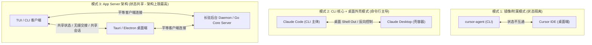

# AI 编程工具/桌面客户端深度对比分析 (2026年最新版)

> **非绑定研究警告（2026-07-09）：** 本文中的产品版本、日期、功能、资源估算和架构
> 断言尚未形成一套经一手资料逐项核验的当前数据集。不得用本文选择运行拓扑、打开
> Wave，或覆盖 `UPSTREAM-BASELINE.md`、`DECISIONS-LEDGER.md`、ADR-0033 与模块规格。
> 文件被保留是因为此前删除过早；未经重新引用和核验的内容只能作为历史线索。

本篇是一次历史研究草稿，尝试比较各类 AI 编程工具的 CLI 与桌面端衔接方式。由于
多数条目尚未以当前一手资料重新核验，它不是客观决策依据，也不参与当前技术路线
门禁。

---

## 1. 核心技术架构与优劣势对比

| 软件名称及最新版本 | 客户端底座与技术栈 | **CLI 衔接方式** | 优势 (Pros) | 劣势 (Cons) | 核心能力与最新进展 |
| :--- | :--- | :--- | :--- | :--- | :--- |
| **Cursor (桌面版)** `v3.10` (2026-07-08) | **底座:** Electron (VS Code Fork) **前端:** TypeScript / JavaScript **后端:** Rust (本地索引器) / C++ / 云端推理 | 无独立 CLI Agent 主线。内置的 `cursor-agent` CLI 仅是**桌面端能力的镜像**，属于附属品，其会话状态与桌面端并不互通。 | `[性能]` Rust 本地索引速度极快 `[生态]` 原生兼容 VS Code 插件生态 `[体验]` 行内代码预测与补全极其精准 | `[资源]` 客户端及本地索引占用资源极大 `[局限]` CLI 是附属品，无法反向接管桌面会话，跨应用自动化能力较弱 | 本地代码库理解与行内预测。最新版本重点更新为 Team Marketplaces 中的 MCPs 机制与组织管理，简化了团队 MCP 服务的集中分发。 |
| **Claude (桌面版)** `v1.15962.2` (2026-07) | **底座:** Electron (Web Wrapper) **前端:** TypeScript / JavaScript **后端:** TypeScript (本地 MCP 宿主) / 云端推理 | 桌面端本质上是 **Shell Out 调用 Claude Code CLI**，CLI 是真正的执行主体；支持通过 `/remote-control` 让手机反向控制本地 CLI 会话。 | `[生态]` 强大的本地/远程 MCP 插件协议扩展性 `[协同]` 具备多端协同画布 (Cowork) `[体验]` 支持 Computer Use 屏幕自动化操控 | `[局限]` 本地无轻量化编辑器或分析引擎，M365 连接器尚为只读集成 `[依赖]` 高度依赖网络 and 云端 API 推理 | 集成 Claude Cowork 多端协同画布，新支持 Microsoft 365 写入工具（自动发邮件、建 OneDrive 文件），具备 Computer Use 屏幕自动化。 |
| **Antigravity (2.0 桌面版)** `v0.10.5` (2026-07) | **底座:** Electron (Bun 本地容器) **前端:** React / TypeScript **后端:** TypeScript (Bun 本地服务) / Python / C++ | CLI 定位未明确公开为主 Agent 入口，系统运行以桌面端主导的 Timeline 证据记录和沙箱校验为主。 | `[性能]` Bun 本地服务冷启动与运行极快 `[体验]` 拥有全 Timeline 行为审查与安全沙箱 `[协同]` 具备多 Agent 团队会话协同能力 | `[生态]` 缺少成熟的 VS Code 庞大插件生态 `[局限]` 传统的重度代码调试能力尚待完善 | 本地优先 (Local-first) 执行流。采用统一的 Action 注册表记录并回滚所有的 UI/Agent 行为。具备本地终端沙箱和基于权限标签（role/domain）的安全矩阵。 |
| **Codex (桌面版)** 2026年7月最新版 | **底座:** Electron (Native Shell) **前端:** TypeScript / JavaScript **后端:** Python / Go (本地 App Server) | **App Server 架构**：CLI 本身是 App Server 的一种客户端形态，支持 `stdio://`、`unix://`、`ws://` 等多传输；`/app` 命令可将 CLI 线程**无缝移交**给桌面端继续。 | `[体验]` 并行 Agent 线程调度（Turn/Thread/Item 原语） `[安全]` 内置操作系统级安全沙箱代码运行 `[协同]` CLI 与桌面端状态无缝迁移 | `[体验]` 作为后台服务，不适合日常手动编码 `[局限]` 已整合入 ChatGPT 订阅包，无独立生态 | 深度合并至 ChatGPT 桌面端。具备并行 Agent 线程处理（Turn/Thread/Item 原语）与操作系统级安全沙箱代码运行。 |
| **TRAE Work (桌面版)** 2026-06-09 大改版 | **底座:** Electron (Web/Desktop Shell) **前端:** React / TypeScript **后端:** Node.js / C++ (本地 IPC) / 云端推理 | 无独立 CLI 主线，产品以协同工作台为核心，CLI 并非该工具的开发重点。 | `[协同]` 统一管理文档、Figma 及代码工作区 `[体验]` 支持多模式（工作/设计/代码）自由切换 `[生态]` 适配非技术岗位无障碍协同开发 | `[局限]` 代码模式下的编辑器底层调优较弱 | 定位“全员 AI 办公协同工作台”，新增“设计模式”自动对接 Figma 交互提取设计系统，支持并行云端任务。 |
| **QoderWork (桌面版)** `v1.13.0` (2026-07-07) | **底座:** Electron (macOS 独立客户端) **前端:** TypeScript / JavaScript **后端:** TypeScript / Python (本地调度) | CLI 衔接定位不明确。合并后架构采用“桌面前端（QoderWork）+ 执行引擎中台（MuleRun）+ 组织后端（Wukong/钉钉）”的三层模式。 | `[体验]` 操作系统级控制与跨应用工作流自动化 `[协同]` 多 Agent 并行专家模式协同能力强 `[中立]` 统一多账户与轻量任务 Quest 机制 | `[体验]` 本地代码文本手写与编辑体验偏弱 `[局限]` 目前偏向 macOS 优化，跨平台体验待提升 | 阿里以 QoderWork 为基座，将 Wukong 与 MuleRun 统一合并至其中。支持 Windows 端的 Computer Use，支持 Qwen 3.7-Max 等模型。 |
| **CodeBuddy (桌面版)** 2026年7月最新版 | **底座:** Electron / JVM (IDE 插件/独立外壳) **前端:** TypeScript (VS Code) / Kotlin (JetBrains) **后端:** TypeScript (Node.js 本地进程) / 云端推理 | 无独立 CLI 主线。作为 IDE 插件运行，完全受制于宿主 IDE 的生命周期约束。 | `[生态]` 完美兼容 VS Code 与 JetBrains 双 IDE `[体验]` 内置双模型高可用诊断与代码生成 | `[局限]` 插件受制于 IDE 架构，缺乏系统级控制力 | 支持双模型融合诊断、Figma 自动转代码，基于 IDE 事件驱动的多子 Agent 协同。 |
| **OpenCode (桌面版)** `v1.17.17` (2026-07-09) | **底座:** Electron (Go App Server) **前端:** React / TypeScript / Go TUI **后端:** Go (本地核心 Server) / Bun (TS Handlers) | **App Server 架构**：本地 Go Core Server 暴露 OpenAPI 3.1 规范端点，TUI 终端与 GUI 桌面端是**平等的客户端**，连接同一 Server，天然共享会话状态。 | `[中立]` 完全的模型中立，支持 75+ 模型自由路由 `[性能]` 超轻量 Go 后端，资源开销少，支持 GUI/TUI `[协同]` TUI/GUI 状态天然一致，无需额外同步层 | `[体验]` GUI 桌面图形端交互及排版相对粗糙 | 开源多模型中立 Agent，具有 SQLite session 本地持久化与多通道 MCP 接口，最新版大幅优化 Windows 终端稳定性。 |
| **Hermes (桌面版)** 2026年7月最新版 | **底座:** Electron (Native Shell) **前端:** React / HTML **后端:** Python / JavaScript (本地服务) | CLI 衔接未见公开文档，系统核心完全以本地自进化机制为主导。 | `[体验]` 本地具有自我进化与持续学习机制 `[体验]` 具备动态工具生成与跨会话长期记忆 | `[资源]` 自我进化迭代过程需要极高算力 `[局限]` 动态自创工具在跨平台运行时易兼容性报错 | 主打持续学习，Agent 能随着时间推移针对本地遇到的软件环境和任务自动编写并优化新工具。 |
| **OpenClaw (桌面版)** 2026年7月最新版 | **底座:** Electron (Python App Server) **前端:** React / TypeScript **后端:** Python (本地网关) / SQLite | 本地 Python 后台网关模式，多通道接入。CLI 主要作为后台网关的配置与管理入口。 | `[体验]` 多通道消息网关集成（Telegram/Slack 等） `[安全]` 内置本地会话隔离与强大的沙箱调用 | `[局限]` 定位为消息守护网关，无手写代码编辑器 | 开源 AI 代理本地网关。提供本地沙箱工具链支持，最新版本加强了操作系统进程调度的安全性，可离线操作本地文件系统。 |
| **AionUi (桌面版)** `v2.1.31` (2026-07-08) | **底座:** Electron (Desktop Shell) **前端:** React / TypeScript **后端:** Node.js (本地 Agent 管理) | **不自带 Agent 执行环境**。其本质是用于管理多个已运行本地 CLI Agent 进程的可视化编排面板，CLI 才是真正的执行主体。 | `[体验]` 提供了高度集成的本地 CLI Agent 统一管理面板 `[体验]` 一键配置、监控并可视化运行各终端 Agent | `[依赖]` 自身无 AI 脑力，完全属于外部依赖态 | 本地协同多 Agent 面板，支持一键自动扫描、启动并协调管理本地已经跑起来的多个不同平台的命令行 Agent 进程。 |
| **Omnigent (桌面版)** `v0.4.0` (2026-07-03) | **底座:** Electron (Orchestration Server) **前端:** React / TypeScript **后端:** Go / TypeScript (元调度服务) | 顶层元调度调度层。本地 CLI 仅作为被调度 and 工作的子 Agent 进程之一接入，CLI 并非该框架的核心主体。 | `[中立]` 多厂商 Agent 元调度与成本政策治理能力强 `[协同]` 强大的多 Agent 并行协作交互与状态追踪 `[安全]` 原生集成 E2B / NVIDIA OpenShell 沙箱 | `[门槛]` 整体架构庞大，个人用户配置与上手成本高 `[局限]` 属于管理调度层，底层代码编辑能力偏弱 | 最新发布了 Omnigent Desktop，支持项目工作区 (Projects Workspace)、智能模型路由配置及沙箱执行。 |
| **Craft Agents (桌面版)** `v0.10.5` (2026-07) | **底座:** Electron (Bun 本地容器) **前端:** React / TypeScript **后端:** TypeScript (Bun 本地服务) / Python (工具脚本) | CLI 衔接未见公开重点设计，系统侧重于任务级的本地文档协作。 | `[体验]` 紧密贴合本地文档与工作区，轻量极速 `[体验]` 内置 Timeline 全流程可审计与回滚能力 | `[局限]` 缺乏重度 IDE 补全链条，侧重任务级代理 | 专为文档和流程执行设计的 AI 协同底座桌面版，拥有统一的进程操作记录与时间线证据链。 |
| **Fleet** 源码规划版 `v0.10.5` (2026-07) | **底座:** Electron (Craft Agents Base) **前端:** React / TypeScript / Jotai / TipTap **后端:** TypeScript (Bun 本地服务) / Python / C++ | **App Server 架构**：真实 CLI 模块 `@craft-agent/cli`（即 `craft-cli` 命令）通过 WebSocket 协议暴露的 RPC 端口与 Electron 宿主的后台 Bun 服务器平等互连，天然共享 session 数据。 | `[生态]` 完备复用 Craft 原版 Shell、会话、审批与时间线，工作量减半 `[协同]` 实现真正的 App Server 模式，多端状态天然同步，任务无缝交接 `[性能]` Bun 后端启动极快，前/后端进程间并发事件隔离优秀 | `[资源]` 桌面端采用 Electron 框架，运行开销略大于 Tauri 等轻量架构 `[生态]` 新增的 Canvas 及 Video 模块处于 cold 启动自研阶段 | 保留 Craft 原生 Workbench 邮件框、权限、审计等核心功能；补强 CLI/Terminal（通过 `craft-cli` 原生的 `run` / `send` 连接宿主服务器）和 Browser/Document；新增 Canvas/Design (引用 OpenPencil) 以及 AIGC/Video (引用 OpenCut)。 |
| **Warp (桌面终端)** 2026-07-07 最新大改版 | **底座:** Rust Native (GPU 引擎) **前端:** Rust (自定义渲染框架) **后端:** Rust 本地终端 / 云端 Warp AI 服务 | **无衔接问题**。终端即是 Agent 宿主，在单一进程中通过 Block 原生进行 Agent 与 Shell 的状态交互。 | `[性能]` 完全原生编写，运行流畅度极佳，无延迟 `[体验]` 自带 AI 命令解释与命令生成 `[体验]` 具备智能 Block 终端输入队列与分组操作 | `[局限]` 闭源商业产品，部分高级功能需要登录 `[依赖]` 遥测 and 云同步存在一定的数据隐私顾虑 | 极速 AI 智能终端。最新大版支持在垂直标签页布局中隐藏搜索栏，修复了大量输入法 (IME) 问题，强化了 UTF-8 字符红线脱敏安全机制。 |
| **Zed (桌面编辑器)** `v1.10.0` (2026-07-08) | **底座:** Rust Native (GPUI 引擎) **前端:** Rust GPUI 渲染层 **后端:** Rust 原生内核 / 接入各类大模型 | Agent Terminal 终端直接内建于编辑器进程中，可通过 `agent.terminal_init_command` 实现本地自动环境初始化与网络白名单白过滤授权。 | `[性能]` 亚毫秒级响应，占用极低内存，打开大文件快 `[协同]` 原生集成顶级多人实时协同编码 `[中立]` 灵活切换大模型，原生支持本地推理源 | `[生态]` 插件生态目前仍处于起步成长阶段 `[局限]` 缺乏传统 IDE 复杂的全图形化配置中心 | 亚毫秒级极速编辑器。最新版支持在 Sidebar 直接创建 Git Worktree，Agent 终端细粒度网络访问限制安全授权（支持白名单主机过滤）。 |

---

## 2. 核心架构解析：CLI 衔接方式的三种模式与上限决定性

通过对上述 16 款软件桌面版及其 CLI 交互机制 of 深度剖析，目前行业的 **CLI ↔ 桌面端 (GUI) 衔接模式**可明确归纳为以下三种。这三种模式直接决定了开发工具的架构上限和协作深度：

### 模式 1：CLI 是桌面端的镜像/附属品 (状态隔离)
*   **代表产品：** Cursor (`cursor-agent`)
*   **特点：** 桌面端 IDE 是核心主体，CLI 只是为了临时满足命令行操作而提供的一个简化“镜像”能力。桌面和 CLI 进程各自独立运行，数据与状态不互通，**无法将命令行中进行到一半的任务移交给桌面端接管**。

### 模式 2：CLI 是主体，桌面端仅是外壳 (命令行主导)
*   **代表产品：** Claude (Desktop) ↔ Claude Code CLI
*   **特点：** CLI 是真正的逻辑执行主体，桌面端本质上是通过 Shell Out 启动本地 CLI 进程并将其包装在网页容器中。虽然支持通过 `/remote-control` 让手机反向操控，但在富文本编辑和本地高性能状态同步（如大文件差异合并、设计系统画布）时，受限于终端管道数据传输。

### 模式 3：App Server 架构，CLI 和桌面是平等的客户端 (状态共享)
*   **代表产品：** OpenCode、Codex (Desktop)
*   **特点：** 本地核心是一个长驻的 **App Server Daemon**（Go Server 或 ts daemon）。CLI 终端 (TUI) 与 桌面客户端 (GUI/Electron/Tauri) 是**地位完全平等的两个展现端**。
    *   它们通过统一的协议（OpenAPI 3.1、WS/Unix Socket）接入同一个后台 Server，**天然共享同一个 Session 状态、Timeline、文件锁与冲突检测**。
    *   用户可以在终端中敲击命令启动 Agent 任务，随时通过 `/app` 或桌面端通知**无缝将整个线程状态迁移到桌面端**，借助富文本和设计画布进行更高级的手工介入，从而达到最高效的混合开发体验。

---

## 3. 选型建议

*   **如果您需要“日常写代码的舒适主力 IDE”：** 优先选择 **Cursor**，它有成熟的 VS Code 编辑器基础，行内代码补全非常爽快。
*   **如果您追求极致的“编辑器响应速度与多人协同编码”：** 优先选择 **Zed**，其 Rust 原生 GPUI 引擎带来了亚毫秒级的延迟，是多人配对编程利器。
*   **如果您需要“极速、现代且带 AI 辅助的本地 Terminal 终端”：** 建议使用 **Warp**，其 GPU 渲染和 Block 智能设计可以大幅提高命令行效率。
*   **如果您是团队中多角色协同（PM/设计/前端）或进行全流程业务交付：** 优先选择 **TRAE Work**，它的多模态协作、Figma 导入设计系统和办公模式能大幅提升协作效率。
*   **如果您需要“自动驾驶式、代替人工执行复杂工程”：** 可以尝试 **Antigravity (2.0)** 或 **QoderWork**，它们擅长在本地多 Agent 协同、执行命令及安全回滚。
*   **如果您需要“高度本地安全隔离，且需要审计 AI 行为”：** 建议使用 **Antigravity (2.0)**，其 Timeline 和沙箱控制能确保行为不失控。
*   **如果您有大量本地其他工具/数据库需要 AI 操控：** 使用 **Claude Desktop** 并搭配相应的 **MCP Servers**。
*   **如果您追求开源自由度，偏好极客风格，且需要多模型无缝路由：** 建议使用 **OpenCode** 桌面端及其 TUI 终端模式。
*   **如果您需要在本地同时开启并统一可视化协调/启动多个不同的 CLI 编码 Agent（如 Claude Code, OpenClaw 等）：** 建议搭配使用 **AionUi** 桌面仪表盘或 **Omnigent** 顶层调度面板。
