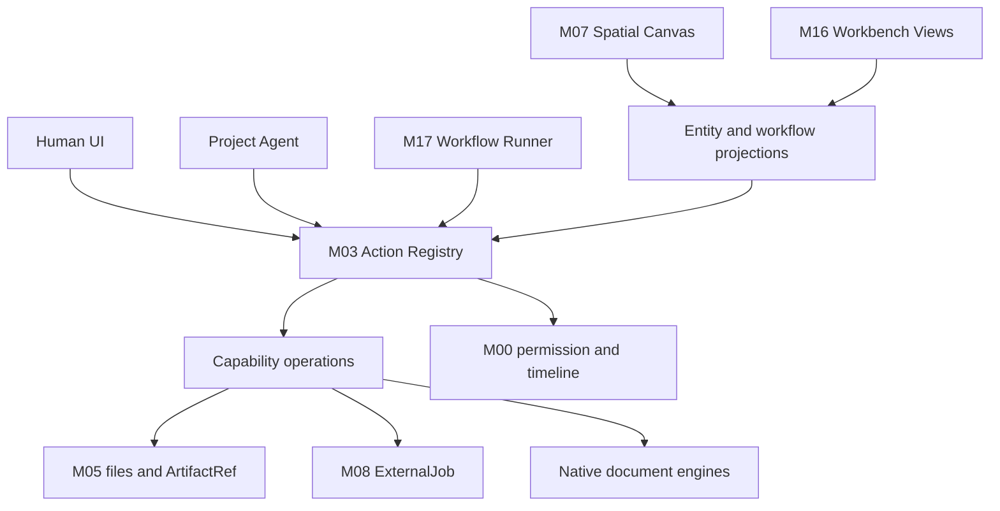
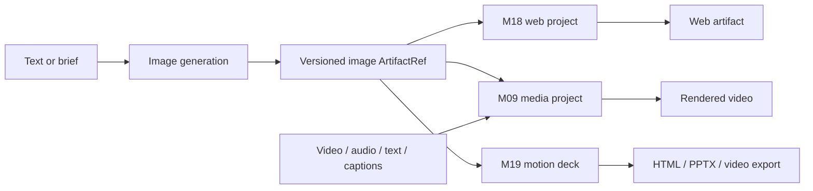

# Composable Workspace Architecture

> **Authority:** binding product architecture; field-level contracts remain proposed until W0.1 re-freeze.  
> **Product status:** `not implemented`  
> **Spec maturity:** architecture approved; contracts in draft  
> **Updated:** 2026-07-09

## 1. Product Decision

Fleet is a modular spatial work operating system inside the retained Craft Agents shell.
The infinite canvas is the place where people and agents arrange project objects, compose
capabilities, inspect results, and open native editors. It is not a new shell and it is not a
single document model that replaces files, browser evidence, design documents, media timelines,
presentations, or web projects.

The selected route is **spatial orchestration plus native editors**:

- the canvas owns spatial presentation and selection;
- capability modules own typed operations;
- the workflow module owns executable graphs and run state;
- native modules own their documents and editors;
- M00/M03 remain the only permission, action, timeline, and audit path;
- M05 carries versioned artifact references without duplicating file contents;
- M08 owns durable asynchronous jobs;
- M16 owns view registration and layout projection.

Two alternatives are rejected:

1. **Embed every application as a live canvas node.** This duplicates state, overloads the
   renderer, and makes lifecycle recovery unbounded.
2. **Use a design editor with a fixed list of media nodes as the whole product.** This cannot
   express future modules or a typed, executable workflow without repeatedly changing the canvas
   core.

## 2. Four Responsibility Planes

### 2.1 Control Plane

M00 and M03 own identity, permission decisions, approvals, action dispatch, idempotency,
timeline evidence, and undo metadata. No module, agent, panel, or workflow runner may bypass
them or append its own authoritative audit stream.

### 2.2 Capability Plane

M12 defines the minimum capability manifest and operation descriptors. A human control, an
agent tool, and a workflow step are three callers of the same operation; they are not separate
APIs. Agent tools and workflow ports are derived from the operation definition.

### 2.3 Orchestration Plane

M17 stores versioned workflow definitions and correlates runs. It validates and schedules
steps, but each step still invokes M03. Long-running work is delegated to M08. Multi-agent work
may use M04, but a WorkflowRun never becomes a second TeamRun or session system.

### 2.4 Presentation Plane

M07 presents spatial entity bindings and workflow projections. M16 presents surfaces, docks,
inspectors, and layout. Both are views over native authority; closing or moving a view never
silently deletes an artifact, cancels a job, or changes a workflow definition.

## 3. State Authority Matrix

| State | Single authority | Canvas/panel responsibility |
|---|---|---|
| session, permission, approval, timeline | M00 | display references and decisions |
| action schemas, dispatch, undo correlation | M03 | invoke registered actions |
| workspace bytes and Library metadata | M05 | bind and preview `ArtifactRef` |
| agent team/run coordination | M04 | display run projection only |
| asynchronous provider/render work | M08 | display job projection only |
| native design document | design module adapter | open editor or render preview |
| media project/timeline | M09 | open editor or render preview |
| web project | M18 | open editor or render preview |
| motion deck | M19 | open editor or render preview |
| capability catalog and loadout | M12 | render available operations |
| workflow definition and run correlation | M17 | edit/render workflow projection |
| spatial positions and visual annotations | M07 | authoritative for spatial document only |
| view instances and layout preferences | M16 using canonical preferences | authoritative for layout only |

## 4. Composable Capability Rule

Every composable operation declares:

- stable capability and operation versions;
- one canonical `actionId`;
- typed input and output ports;
- accepted and produced artifact kinds;
- execution mode: inline, runtime lane, local job, or external job;
- risk, approval, undo, cancellation, retry, evidence, and resource policies;
- optional canvas renderer, inspector, panel, or full-surface contribution.

These declarations are metadata. They never grant permission. The effective caller manifest is
still derived from M00 identity and M12 loadout rules.

## 5. Artifact Handoff

Modules exchange `ArtifactRef` values, not raw renderer objects and not untracked file paths.
An ArtifactRef points to an authoritative file, Library record, evidence bundle, or native
document version. It carries type, version, hash when available, provenance, sensitivity,
preview, and parent references.

The envelope is not a third asset database. M05 owns its metadata and resolves it to the real
file or native document owner. A generated image may therefore fan out to a web project, video
timeline, and presentation without copying the source bytes or losing provenance.

## 6. Canvas Semantics

The canvas has two explicit interaction modes:

1. **Space mode:** free arrangement of artifact cards, notes, native-document portals, groups,
   and non-executable reference connectors.
2. **Workflow mode:** a visual projection of one M17 WorkflowDefinition. Step nodes and typed
   edges are edited through M17 actions; M07 stores only their spatial layout bindings.

A line drawn in Space mode is never executable. An executable connection exists only after M17
validates compatible ports and commits a workflow edge. This removes the dangerous ambiguity
between visual arrows and data/control flow.

Live editors are not mounted in every node. Nodes use static previews by default. A user opens
the native editor in the main stage or work panel; narrowly scoped live previews may activate
only while visible and within a measured resource budget.

## 7. Workbench View Model

M16 is the only view contribution and layout host inside the existing Craft shell. The default
v1 composition is:

- left project navigator;
- one main stage for chat, canvas, browser, design, video, web, or presentation;
- right contextual inspector for the selected entity or step;
- bottom work dock for terminal, jobs, timeline, and editor-specific timelines.

This layout is a default rendering policy, not a permanent data model. A versioned layout graph
allows later docking changes without modifying every module. Agents may reveal an entity or
open a relevant view, but may not silently persistently rearrange the user's layout.

## 8. Agent-Created Workflows

An authorized Agent may:

1. discover composable operations from the effective capability manifest;
2. create a draft workflow;
3. bind inputs, outputs, and ArtifactRefs;
4. validate port compatibility, availability, permissions, budget, and acyclicity;
5. show the draft in M07 and its details in M16;
6. start a run within the existing L0-L3 policy;
7. observe step/job state and propose a versioned repair after failure;
8. save the workflow as a reusable project artifact.

The workflow definition is inspectable project state, not hidden agent reasoning. The running
definition is immutable; repairs create a new definition version or an explicitly recorded run
patch that is revalidated before execution.

## 9. Autonomy Boundary

Workflow execution inherits D12:

- L0 and approved L1 operations may run automatically within a declared budget;
- L2 requires an applicable pre-authorization or a human decision;
- L3 always pauses for explicit human confirmation;
- external publish, destructive overwrite, permission elevation, secret exposure, and
  unbounded/high-cost render are never silently authorized by workflow creation.

Approval is evaluated per real operation. A workflow cannot pre-authorize actions that the
initiator could not invoke directly.

## 10. Reference Production Flow

This diagram describes the target composition, not the first implementation slice.

## 11. Delivery Slices

### Slice A — Composable Spine

Freeze the capability, ArtifactRef, workflow, view, idempotency, and revision contracts. Build
no creative surface before the contracts and v0.11 migration gate agree.

### Slice B — First Real Loop

Text input -> one real image generation operation -> durable ExternalJob -> output file and
ArtifactRef -> canvas result card. Human and Agent can create the same two-step workflow, one
approval pause is exercised, and restart recovery is demonstrated.

### Slice C — Fan-out

The same image version feeds one minimal but real web project, one motion deck, and one media
project. Outputs return as ArtifactRefs and remain traceable to the input image and workflow run.

### Slice D — Multi-asset Editing

M09 accepts image, video, audio, text, captions, and rendered web/deck segments, edits them in a
native media project, and renders through M08.

## 12. Resource Behaviour

- UI rendering never owns provider or render execution.
- Heavy work declares a concurrency class and uses M08 back-pressure.
- Off-screen live previews suspend; jobs continue independently.
- Canvas mutation uses document revision and a bounded commit queue, not timeline sequence as a
  conflict algorithm.
- Stale writes return a visible conflict; there is no silent last-write-wins merge.
- Degradation proceeds from static previews to reduced auxiliary updates to a visible queue or
  split-space recommendation. The product must not freeze silently.

Numeric node/FPS thresholds are not frozen in this document. They require a repeatable hardware
baseline and adapter spike before becoming acceptance criteria.

## 13. Non-Goals for v1

- arbitrary cycles, unbounded loops, or a general programming language in workflows;
- embedding full Chromium, design, video, and presentation editors in every canvas node;
- real-time remote multi-user CRDT collaboration;
- a second task, session, permission, memory, job, or artifact store;
- external plugin distribution before core capability manifests work for built-in modules;
- full-fidelity animated PowerPoint compatibility.

## 14. Evidence and Freeze Gates

The following remain blocking and must be recorded as evidence rather than guessed:

1. Craft Agents v0.11 migration ledger and clean base validation.
2. W0.1 canonical protocol parity and contract version.
3. React infinite-canvas/graph adapter spike and license decision.
4. Editable design-engine adapter spike; OpenPencil is not the spatial host by assumption.
5. Exact canonical preferences/layout integration.
6. Real provider/local image-generation path for Slice B.
7. Repeatable resource benchmark and degraded-state wording.

