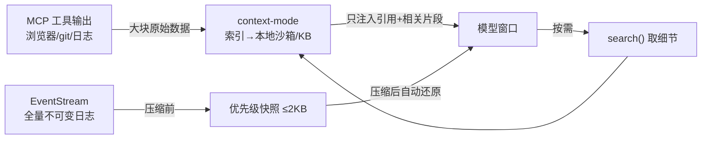

# 上下文管理方案（自动 · 内置）

> 当前状态：未来参考。当前主基座为 craft-agents-oss，本文不作为当前实现入口；后续做记忆/上下文压缩时再按许可证和接口隔离评估。

> 状态：**方案定稿**。配套《技术选型与架构.md》。
> 目标：**保证输出效果的同时，全自动管理上下文**——长会话、多工具也不爆窗口、不丢状态，且检索到的永远是相关内容；对新手完全无感。
> 评估对象：[mksglu/context-mode](https://github.com/mksglu/context-mode)（README 数据为依据）。

---

## 1 · 问题：上下文有"两半"

| 半边 | 症状 | 在你这工具里的来源 |
|---|---|---|
| **工具输出半** | MCP 工具把原始大块直接塞进窗口：浏览器快照 56 KB、20 条 GitHub issue 59 KB、日志 45 KB。30 分钟后 40% 窗口没了 | 你的 **MCP 控制总线**全是这种源（浏览器/git diff/shell 日志） |
| **对话压缩半** | 窗口满 → 压缩 → 智能体忘了在改哪个文件、什么任务在跑、你上一句要什么 | 任何长会话 |

context-mode 把自己定位成"上下文问题的**另一半**"——多数方案只压缩对话，它把**工具输出**这半也接管了。两半正好都是你需要的。

---

## 2 · 选型结论：用 context-mode 当引擎

TS/Node + 本地 SQLite 的上下文中间件（npm `context-mode`）。两个机制对上两半问题：

**① Sandbox + 知识库（治工具输出半）**
工具输出不直接进窗口，先**索引进本地知识库**，模型按需 `search()` 取**相关片段**——不是首 N 字截断。检索栈：BM25 + Reciprocal Rank Fusion + 邻近重排 + 模糊纠错 + 智能片段（可按 `code`/`prose` 过滤）+ TTL 缓存（跨重启保留，不重复抓取、不浪费 token）。**全程本地沙箱，不出网。**

**② 会话续连（治压缩半）**
压缩前抓一个 **≤2 KB 的优先级分层快照**（P1 关键状态 → P4 引用，预算紧就丢低优先级），存进 `session_resume` 表；压缩或 `--continue` 后**自动还原**，模型从你上一句继续，不用你重述。

**③ 对你最关键的一点：context-mode 原生支持 Pi。**
README 明确列出 "OpenClaw / **Pi Agent** — 原生网关插件，自动，无需手动配 hook"、"**Pi Coding Agent** — 全 hook 支持"。你选的 harness 就是它的一等公民，几乎装上即用。它靠 hooks（UserPromptSubmit / SessionStart / 压缩钩子）做**自动路由**（把模型从原始大输出"推"向知识库检索）+ 快照 + 还原——这就是"自动"。

> 它还同时支持 Claude Code（插件市场，全自动）、Codex、Cursor、VS Code Copilot、OpenCode、Zed 等——正好覆盖你要托管的那些外部 CLI，一套上下文层管全场。Gemini CLI 当前已从 Fleet 内置探测中删除，只保留为后续 custom runtime 的可能性。

---

## 3 · "完美"要在它之上再补四层

context-mode 解决了两半，但一套**完整**方案还要这四层（它不全包）：

1. **工具层先减量**：在你的 MCP 总线就给每个工具加 `brief / fields / max_chars / max_items` 边界（你 `CLIENT_REQUIREMENTS.md` 的 "Tool RAG" 已经这么要求）。源头少吐，知识库压力更小。
2. **子智能体隔离**：队长把子任务派给小队成员时，成员用**独立干净窗口**跑，只回**摘要**给队长——这是压住队长窗口最有效的杠杆。靠 EventStream 让"只回摘要"可落地。
3. **KV-cache 友好的稳定前缀**：系统提示 / 工具定义保持**稳定、追加式**，别每轮重排，最大化提示缓存——省钱省延迟。
4. **分层记忆**：工作记忆（本会话）/ 长期记忆（跨会话、写文件）。你 docs 里的资产 / 笔记体系正好当长期记忆，与 context-mode 的 TTL 知识库分工。

---

## 4 · 在你架构里的位置

context-mode 坐在**工具输出与模型之间**、以及**压缩点**上。与 EventStream 的关系：EventStream 是你自己的**全量不可变日志**；context-mode 负责"进窗口前选什么 / 压缩时留什么"的**装配与压缩策略**。两者互补，不冲突。

---

## 5 · 落地与里程碑

- **M1（外壳+工具）**：接 context-mode（Pi 网关，默认开启）；MCP 工具加 `brief`/字段边界。→ 长工具输出不再爆窗口。
- **M2（编排）**：子智能体隔离 + 只回摘要；长期记忆写文件；稳定前缀 / 提示缓存。
- 全程**默认开启、对新手无感**，这就是"自动进行上下文管理"。

---

## 6 · 取舍与风险

| 风险 | 说明 / 应对 |
|---|---|
| **License = ELv2**（Elastic License v2，**非 OSI 开源**） | 内嵌进你自己发行的桌面 App 一般可行，但 **不可当托管服务转售、不可去授权键、不可抹授权声明**；改源 / 再分发前务必读 ELv2 原文。你别的参考多是 MIT/Apache，这个不同——**合规单独评估**（我非律师，仅提示） |
| 成熟度 | 较新、社区小（Discord/npm）；硬依赖前评估维护活跃度。用**接口隔离**包一层，必要时自研同形方案兜底 |
| BM25 是词法检索 | 遇到语义改写可能漏召回；需要时叠一层**向量检索**（可选增强） |
| 隐私 | 本地沙箱、不出网 —— 符合你"离线 / 隐私可见"原则 ✓ |

---

## 7 · 一句话

**引擎用 context-mode**（Pi 原生、本地、两半全治），**上面补四层**（工具减量 / 子智能体隔离 / 稳定前缀 / 分层记忆），默认全自动——这就是"保证输出效果 + 自动管理上下文"。唯一要先落实的是 **ELv2 许可的合规确认**。
