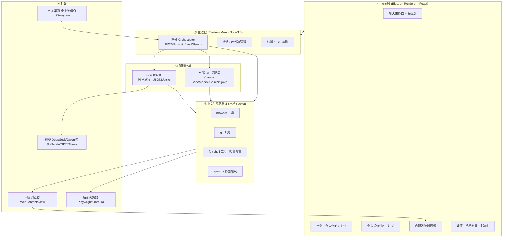
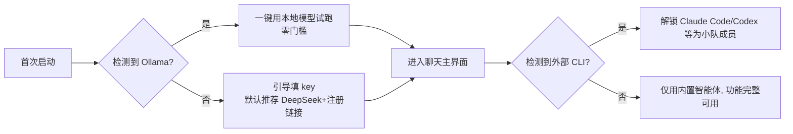

# 终端智能体编排工具 · 技术选型与架构方案（历史归档）

> 历史归档：本文描述的是切换到 craft-agents-oss 之前的自研架构方案。当前主基座为 `app/` 下的 craft-agents-oss，当前路线见 `docs/Fleet-开源项目融合路线.md` 和 `docs/Fleet-Craft-功能缺口审计.md`。

> 状态：**方案定稿（v3 起步）**。面向新手的"统一外壳"——一个像群聊一样轻松、把功能全按钮化的桌面智能体编排工具。
> 本文综合了对 8 个参考项目（zed / warp / AionUi / Kun / golutra / cmux / multica / craft-agents-oss）的源码核对，以及 Obscura、Pi、OpenHands 的评估。
> 关联：`docs/UI_TARGET_ARCHITECTURE.md`、`docs/CLIENT_REQUIREMENTS.md`、`docs/上下文管理方案.md`。

---

## 0 · 一页决策摘要

| 维度 | 结论 | 依据 |
|---|---|---|
| 桌面框架 | **Electron**（不用 Tauri / 原生 Swift） | 内置浏览器、托管多 CLI、卡片化、IM、手机触发，Electron 阻力最小；4 个最相关参考全是 Electron |
| 语言 | **TypeScript 全栈一种** | renderer / 主进程 / 编排 / 工具 / IM 桥全 TS；你的 v2 已是 TS |
| UI | React + Zustand + i18next（**默认中文**） | 抄 AionUi / Kun |
| 智能体 harness | **偏 Pi**（pi-agent-core + pi-ai），不引 OpenHands 平台 | Pi 是可嵌 TS 库、轻；OpenHands 是 Python + Docker 平台，过重且错位 |
| **内置智能体（自带 CLI）** | Pi 驱动，**随 App 出厂**，零外部 CLI 即可用 | 本方案核心，对标 AionUi 自带智能体 |
| 模型接入 | **BYO key（默认推荐国产 DeepSeek/Qwen/智谱）+ 本地 Ollama 零配置兜底**，多家可选 | 你拍板：不自建后端、不做计费 |
| 外部 CLI | Claude Code / Codex / Gemini / Qwen **检测到才解锁**（可选增强） | "统一外壳"：适配器托管，不重写 |
| 工具层 | **本地 MCP 控制总线**（一套工具同时喂内置智能体和外部 CLI） | 抄 cmux 控制 socket + craft session-mcp-server |
| 浏览器 | **双层**：WebContentsView 可见浏览器 + Playwright（可选 Obscura）后台自动化 | cmux 能力可复刻；Obscura 是 headless，只能当后台 |
| 事件模型 | **EventStream**（动作/观察不可变日志，TS 实现） | 偷 OpenHands 最佳设计，驱动收件箱卡片/回放/IM 转发 |
| IM / 手机 | 多渠道 channels，**优先企业微信 / 飞书 / Telegram** | 抄 AionUi channels；个人微信有封号风险 |
| 打包 | electron-builder（Mac dmg + Win nsis） | 抄 Kun |
| **上下文管理** | context-mode 当引擎（**Pi 原生支持**）+ 工具减量/子智能体隔离/稳定前缀/分层记忆 | 你点的 mksglu/context-mode；本地、自动、保证相关性。详见《上下文管理方案.md》 |

**一句话**：Electron + TypeScript 全栈；以 **Pi 内置智能体**为出厂大脑（BYO key + Ollama 兜底），以 **MCP 控制总线**为工具脊柱，以 **EventStream** 为数据流，外部 CLI 与 IM/手机都接到同一套总线上。

---

## 1 · 总体架构

### 1.1 分层



### 1.2 进程模型（为什么这么拆）

主进程是**队长**和总线宿主；每个**智能体跑在独立子进程**（崩了不拖垮 UI，抄 craft 的 `pi-agent-server`：JSONL over stdio）；渲染进程只管画界面和转发事件。外部 CLI 也是子进程，通过适配器接进来。手机/IM 的消息从 channels 进来后，和你在界面里发的消息**走同一条队长入口**——这是"离开电脑也能干活"的关键：入口统一，触发路径就统一。

---

## 2 · 核心：内置智能体（自带 CLI）

这是本工具区别于 cmux / golutra 的地方——**不依赖用户预装任何 CLI，出厂自带一个能干活的智能体**，对标 AionUi。

### 2.1 用 Pi 当大脑

`@earendil-works/pi-agent-core` + `@earendil-works/pi-ai`：前者是 agent 循环（工具调用、会话、流式），后者是模型抽象（任意 provider / OpenAI 兼容端点）。craft-agents-oss 的 `pi-agent-server` 已证明可以把它做成**独立进程 + JSONL/stdio**，直接照抄。

内置智能体同时暴露**三种入口**，共用同一个 Pi 核心：
1. **图形界面**——聊天主界面里的默认队长/小队成员。
2. **自己的命令行 `ov`（或你的命名）**——把内置智能体做成 CLI 入口，高级用户可在终端直接用、可被脚本调用。这就是"自己也有 CLI"。
3. **MCP 客户端**——内置智能体也通过第 4 节的总线拿工具，和外部 CLI 平权。

### 2.2 模型接入（按你的拍板：不建后端）

- **默认 BYO key**：设置里填 key，**默认推荐国产 DeepSeek / Qwen / 智谱**（便宜、国内直连快、与汉化/飞书/微信定位一致）；同时支持 Claude / GPT 等，多家可选，via `pi-ai`。
- **本地 Ollama 零配置兜底**：检测到 Ollama 就直接用，**零 key、零联网、零成本**，保证"装上就能动"。
- **不做第一方托管后端 / 计费**（你已排除）。

### 2.3 新手首启流程（诚实可见）



> 取舍：不建后端意味着首启仍需"装 Ollama"或"填一个 key"二选一，不是绝对的一键零配置。若日后想做到真正零门槛，可加一个**免费托管层**（本方案预留接口，不在 v1 实现）。

---

## 3 · 统一外壳：托管外部 CLI（检测到才解锁）

外部 CLI 是**增强项**，不是前置条件。

- **检测**：`detect` 模块扫 PATH + 常见安装目录，识别 `claude` / `codex` / `gemini` / `qwen` 及系统终端/shell（跨 Mac/Win）。
- **托管**：`node-pty` 把 CLI 当伪终端拉起；每个 CLI 一个**适配器**，归一化输入输出。能走官方协议就走官方（Claude Code 的 Agent SDK / ACP；其余 CLI 走 stdio + 各自参数）。
- **喂工具**：外部 CLI 都是 MCP 客户端，直接连第 4 节的总线，拿到和内置智能体**同一套**工具（craft 的 `session-mcp-server` 就是这么把工具喂给 Codex 的）。

---

## 4 · MCP 控制总线（工具脊柱）

**最该抄 cmux 的不是某个功能，是这条总线**：把浏览器操控、git、fs/shell、spawn 智能体、控界面，全做成**本地 socket 上的一组 MCP 工具**。

- 实现：Node + `@modelcontextprotocol/sdk`（官方就是 TS）。
- 调用方：①内置 Pi 智能体 ②外部 CLI ③队长 ④IM/手机——全连同一条总线。
- 安全：你掌控这台 server，天然能做**审批门**（危险工具调用前弹确认，抄 cmux 的 MCP approval gates）。
- 隔离：fs/shell 工具走 craft 式**轻量隔离**（filesystem-isolation / network-isolation / path-security），危险任务可选上 Docker。

---

## 5 · 队长 + 小队编排

- **队长 Agent**：接自然语言任务 → 解析意图 → 按能力把活派给小队成员（内置智能体 or 外部 CLI）→ 监督 → 汇总。委派模型借鉴 OpenHands 的 agent-controller + 专家子智能体。
- **@提及**：聊天框 @ 自动补全解析到智能体注册表（每个成员 = 一份配置：用哪个引擎、角色、工作目录、模型）。
- **EventStream**：每个动作/观察都是不可变事件追加进日志（偷 OpenHands 事件溯源）。它一份数据同时驱动：①收件箱卡片流 ②流式 UI ③回放/撤销 ④IM 转发。
- **多会话收件箱**：文档卡片流（不是代码树），一会话一卡片，抄 cmux/你 docs 里的"资产卡"。

---

## 6 · 浏览器、Git、注释、Skill（cmux 能力复刻）

| 能力 | 复刻方式 | 难度 |
|---|---|---|
| **可见内置浏览器** | Electron `WebContentsView`（自带 Chromium）+ omnibar + 标签 + 代理 + `capturePage` 截图 | 低 |
| **智能体操控浏览器** | `webContents.debugger` 直给 CDP，或挂 Playwright；导航/点击/抽取/截图做成 MCP 工具 | 低 |
| **后台 headless 浏览器** | Playwright（默认真 Chromium），**可切换 Obscura**（省内存/反检测，但太新、非 Blink 渲染，不做唯一依赖） | 低 |
| **注释** | 即 cmux 的 **diff 行级评论**（代码审查式，带移动/过期重锚），不是网页注释；React diff 视图挂内联评论 | 中 |
| **Git 管理** | 每会话一个 `git worktree`（simple-git）+ diff 流 + PR 侧栏（octokit） | 中 |
| **Skill** | 标准 `SKILL.md`（name/description frontmatter）加载器；外部 CLI 本身也吃 Skill | 低 |

> 实话：复刻"能用"是几天，复刻 cmux 那种**打磨与可靠性**（omnibar 联想、profile 导入、隐藏 webview 回收内存、十几个 UITest）才是真功夫。

---

## 7 · IM / 手机触发

- **多渠道 channels**：直接抄 AionUi 的 `channels/`（它把企业微信 / 微信 / 飞书 / Telegram / 钉钉 五个渠道的配置表单 + e2e 测试都做完了）。消息进来转给队长入口。
- **优先级**：默认主推**企业微信 / 飞书 / Telegram**（都有官方 API、合规）。**个人微信无官方机器人 API、第三方自动化违反腾讯条款、有封号风险**，做成"高风险可选项"。
- **内网穿透**（桌面在 NAT 后收不到 webhook）：Telegram 用长轮询免公网；飞书 / 钉钉用官方**长连接 / Stream 模式**免公网回调；企业微信需一个轻量云中转。**建议从 Telegram 起步**验证最简单。

---

## 8 · 新手友好设计（贯穿全局）

零学习成本是第一目标：**默认中文**（i18next，所有快捷智能体/按钮汉化）；**功能全按钮化**（把 CLI 的命令/参数映射成按钮和表单，而不是让新手敲命令）；**一个输入框吃一切** + @ 选人；**诚实可见**（跑前给计划卡、跑中给进度、隐私/离线/成本常驻，抄你 docs 里的四态原则）；**首启向导**（第 2.3 节）保证装上就能动。

---

## 9 · 技术栈清单

| 层 | 选型 |
|---|---|
| 桌面 | Electron + electron-vite |
| UI | React + Zustand + i18next + react-diff-view/monaco（diff）+ xterm.js（终端视图） |
| 内置智能体 | `@earendil-works/pi-agent-core` + `pi-ai`（多 provider） |
| 默认模型 | DeepSeek / Qwen / 智谱（默认）· Claude / GPT（可选）· **Ollama 本地兜底** |
| 工具总线 | `@modelcontextprotocol/sdk`（TS）+ 本地 socket |
| 浏览器 | WebContentsView（可见）+ Playwright（后台，可选 Obscura） |
| Git | simple-git + `git worktree`；octokit（PR） |
| 外部 CLI | node-pty + 各自 ACP/MCP 适配器 |
| IM | 各平台官方 SDK；Telegram 长轮询 / 飞书·钉钉长连接 |
| 隔离 | craft 式 fs/network/path（参考其 `session-tools-core/runtime`），可选 Docker |
| 打包 | electron-builder（dmg + nsis） |
| 上下文管理 | context-mode（ELv2 · 本地 SQLite+BM25）+ 自研补充层 |

---

## 10 · MVP 分期

| 里程碑 | 目标（验收=新手能做到什么） | 主要内容 |
|---|---|---|
| **M0 骨架** | 装上就能聊天 + 干活 | Electron+React 起步；内置 Pi 智能体跑通（Ollama / BYO key）；聊天主界面 + 左侧 Agent 侧栏；汉化；首启向导 |
| **M1 外壳+工具** | 能用工具、能解锁外部 CLI | MCP 总线 + fs/shell/git 工具；检测并托管 Claude Code/Codex；@ 提及多智能体；**接入 context-mode（上下文自动管理）** |
| **M2 浏览器+编排** | 能开浏览器、能群聊式派活 | 内置浏览器（可见）+ 后台自动化；队长派活 + EventStream 收件箱卡片；diff 评论；Skill 加载 |
| **M3 手机/IM** | 离开电脑用手机触发 | channels（先 Telegram + 飞书）；内网穿透；Mac/Win 打包发布 |

---

## 11 · 建议目录结构（monorepo · pnpm/bun workspaces）

```
app/
  apps/
    desktop/          # Electron 主程序：main + preload + renderer(React)
  packages/
    agent-core/       # 内置智能体大脑：封装 pi-agent-core + pi-ai
    agent-cli/        # 把内置智能体做成命令行入口（"自己的 CLI"）
    harness/          # Pi 子进程管理：JSONL/stdio、生命周期、崩溃隔离
    orchestrator/     # 队长：意图解析、派活、EventStream、会话/收件箱
    mcp-bus/          # 本地 MCP 控制 server（工具总线）
    tools-browser/    # 浏览器工具（CDP/Playwright）
    tools-git/        # git / worktree / PR
    tools-shell/      # fs / shell + 轻量隔离
    cli-adapters/     # claude-code / codex / gemini / qwen 适配器
    browser/          # 内置浏览器(WebContentsView) + 后台(Playwright/Obscura)
    channels/         # IM：企业微信/飞书/Telegram/钉钉/微信
    detect/           # 终端 & CLI 检测（跨 Mac/Win）
    i18n/             # 汉化资源
    ui/               # 共享 React 组件（卡片流、@提及、Agent 侧栏）
    shared/           # 类型、EventStream schema、themes.json
```

---

## 12 · 风险与取舍

| 风险 | 应对 |
|---|---|
| 不建后端 → 首启非真·零配置（要 Ollama 或一个 key） | 预留托管层接口，日后可加免费额度做到真一键 |
| Electron 体积 / 内存比 Tauri 重 | 接受；给普通人用、要内置浏览器，功能优先；后续可优化 |
| 个人微信封号风险 | 默认推企业微信/飞书/Telegram，个人微信标"高风险可选" |
| Pi 生态小、文档少 | 关键路径读源码兜底；craft-agents-oss 当活参考实现 |
| Obscura 太新（v0.1.0/非 Blink） | 后台浏览器默认真 Chromium，Obscura 做可切换后端 |
| cmux 级打磨工作量大 | 先做“能用”，可靠性靠迭代；别在选型上纠结 |
| context-mode 是 ELv2（非 OSI）+ 较新 | 内嵌发行一般可行但不可转售/去授权；合规自查，接口隔离便于替换。详见《上下文管理方案.md》 |

---

## 13 · 下一步

1. 确认本方案 / 命名（产品名、内置 CLI 命令名）。
2. 我可以直接脚手架出 `app/` 的 M0 骨架：Electron+React + 内置 Pi 智能体（Ollama/BYO key）+ 聊天主界面 + 左侧 Agent 侧栏 + 汉化。
