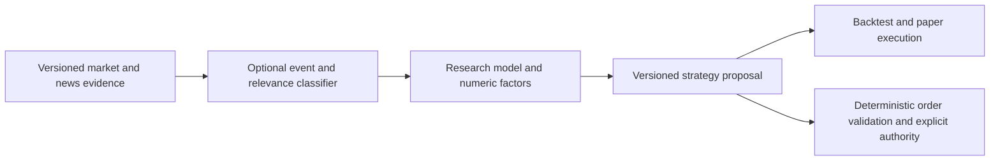

# Typed model decisions and staged execution

Sub-contract of [Models](models.md); [INTEL-03](../capabilities.md#capability-register) owns delivery
status. [Agent core](agent-core.md) owns admission, permissions and durable work;
[Context](context.md) owns projection and accounting. This contract introduces no second kernel,
Session, credential store or decision-log authority. Source locks are in the
[reference intake](../references.md#typed-decision-model-and-quantitative-research-intake).

<!-- module-card: generated by scripts/module_cards.py from the capability register; do not edit -->
## Module card

0 register rows whose loop is this module ([register](../capabilities.md#capability-register)). Status is the register's; change it there, then run `python3 scripts/module_cards.py`.

No register row yet.
<!-- /module-card -->

## Selected implementation

Retain ZCode Host + Pi Agent Core. Use the already installed Pi AI 1.0.1 classifier transport for
bounded `choice`, `score` and `bool` auxiliary calls. Pi translates `bool` to System One `noul`.
A classifier is a separate operation/model type, not a chat model with a different prompt.
No new System One SDK, Pi Coding Agent autoload, LangGraph host or universal router is required.
Backend availability, calibration and per-platform latency still need their own proof.

| Purpose | Operation and configuration owner | Separation |
|---|---|---|
| Main conversation | Existing chat model/draft/Session choice | Explicit human choice remains authoritative |
| Planning / execution | Opt-in phase-specific chat choices through the existing preference owner | Different from classification and named child-agent defaults |
| Auxiliary decisions | Optional classifier choice through the existing Provider/preference owners | Only classifier-eligible routes; no reasoning slider or chat generation endpoint |
| Child agents | Existing Subagents settings and runtime | Reuse named roles instead of duplicating their configuration |
| Quantitative prediction | Domain model/features/dataset and backtest run | Not an ordinal score or sentiment probability |

The classifier transport's response guard is implemented in the existing Pi AI patch. The Host
classifier purpose, operation, Settings control and plugin entry still need implementation; library
availability and loopback tests do not establish those capabilities. Do not expose inert switches.

## Request and receipt contract

1. Master enablement and the consuming feature's enablement default off. An explicit call has a
   named purpose; opening Settings, listing models or checking readiness does not run inference.
2. Catalog identity includes operation type. Pi's `getAllModels`/`getModelsOfType` retain classifier
   and image entries; chat-only catalog methods cannot discover them. One upstream ID can exist
   under more than one operation type. Do not materialize a classifier as a chat model with invented
   reasoning levels, text generation, tool support or context capacity.
3. Bind provider/account, catalog/settings revisions, requested model, question-schema version,
   input/evidence version, Session/operation and cancellation scope before dispatch. Resolve the
   credential through the existing Provider owner and revalidate before every batch item starts.
   A one-second credential/settings cache is not a revocation boundary.
4. Project only the evidence needed for these questions. Never forward a complete conversation,
   credential-bearing tool arguments, every installed capability or raw Provider configuration.
   Keep original evidence retrievable. Oversized/truncated evidence makes the decision incomplete;
   do not silently turn it into a confident control decision. Local model state/head token budgets
   are separate from the language model's context window.
5. Use Pi's typed transport behind Host request admission and accounting. The same Stop signal
   reaches HTTP and queued items. A foreground optional check gets one bounded attempt; timeout,
   uncertain submission and retries must not evade the total deadline or caller's model budget.
   Cancellation stops the check rather than starting its fallback model.
6. System One endpoint normalization belongs to the existing endpoint layer. Craft appends
   `/v1/systemone` to a root URL; Pi appends `systemone` to its `/v1` base. OpenRouter therefore uses
   `/api/v1/systemone`. Never append `/v1` twice or copy an OpenAI Chat URL into this operation.
7. Validate own offered labels, complete probability keys, finite values in [0,1], approximately
   unit probability mass and a score inside its ordered rubric. Reject an unoffered or
   distribution-inconsistent choice. Allow documented serialization rounding without renormalizing
   bad data; Laya rounds its option probabilities to four decimals. Invalid answers remain errors,
   including when the provider reports billed usage. Never clamp invalid values into certainty.
8. Record requested and actually reported model separately; aliases do not prove served identity.
   Pi's normalized classifier result currently echoes the requested ID and drops score distributions
   and backend extensions. Capture required raw metadata at the transport boundary before relying
   on served-model pinning, score calibration or a local server's truncation report.
9. Use the existing journal/usage owner for request, result/abstention, failure, outcome and later
   evaluation. Missing usage remains unknown. Classification contributes to total accepted-outcome
   cost, not a free hidden side call or another `decisions.jsonl` billing authority. It does not
   replace the main conversation's account/context meter.

## Confidence and authority

Keep provider confidence, selected-label probability, distribution margin and observed accuracy as
separate values. Laya `confidence` is normalized entropy; `answer_confidence` is a different,
calibration-dependent value. Its router selects a multilingual checkpoint for non-English scripts;
English-checkpoint confidence is not evidence of Chinese accuracy. Thresholds belong to a versioned
feature policy evaluated on held-out examples for model/checkpoint, language, question/label schema
and option-count bucket. A generic 0.8 cutoff copied from another feature is not a calibrated policy.

A decision may annotate, rank already permitted candidates, recommend or abstain. It does not approve
an action, enable a source/plugin, change a frozen input, merge accepted messages, switch an explicitly
selected model, or overwrite human labels/titles. Existing deterministic rules and human permission
remain authoritative. Semantic advice about an action is separate from permission to perform it.

Failure semantics belong to the consumer, not a global fallback:

| Consumer | On disabled/unavailable/invalid/uncertain result |
|---|---|
| Tool/Skill suggestions | Keep the existing permitted search/selection path; enable nothing |
| Optional news/post filtering | Keep original items visible/available and mark screening unavailable |
| Required strategy/event condition | Abstain; do not interpret unknown as an approved action |
| Trading/order request | Deterministic validation and explicit authority still apply; no model approval |
| Optional summary/effort optimization | Keep the original behavior and selected effort until a measured policy is admitted |

Craft's active Guarded check preserves its Execute-like allow on a one-off missing/failed answer;
turning the feature off instead changes effective mode to Ask. Its semantic automation condition
returns the original run behavior when the check is unavailable. These are different defaults and
must not become a trading authorization or mandatory-condition fallback in Fleet.

## Planning and execution

Keep planning/execution chat models configurable independently of the classifier. An approved,
version-bound plan receipt marks handoff; a first successful file edit does not. Pi's `jev-router`
example rates coding complexity and switches to an implementation model after `edit`/`write`, which
has no equivalent for research, generation or trade analysis and starts effectful work before that
switch. It is an example, not Fleet's phase policy.

Planning remains under its current read-only/allowed operation contract. Execution resolves and
admits its own model/options against the approved plan version. Preserve tool schema/permission,
queue, usage and artifact identities across handoff; keep vendor-native continuation boundaries.
Restart must restore the admitted phase and receipts without replaying a completed effect. Ordinary
conversations keep their current model. Failure or unavailable configuration uses an explicitly
specified fallback/abstention policy, never an undisclosed model or provider change.

## First consumers and quantitative suite

First complete the classifier catalog/purpose + one governed explicit classification operation,
with a small retained dataset, before adding automatic harness behavior. Reuse the existing deferred
tool catalog for an optional classification tool. Then measure tool/Skill candidate ranking and
news/event annotation. Semantic automation conditions follow actual workflow integration. Adaptive
thinking, message merging and permission advice require separate behavior/quality acceptance;
enabling all thirteen Craft toggles at once is not a minimum implementation.

The optional Trading/Market Analysis Component follows the existing [product scope](../product.md#the-rule-that-decides-scope):

TradingAgents supplies relevance/stance screening, per-tier provider choices, typed proposals and
run-signature checks. Its `backtest.py` evaluates ratings on independent ticker/date cells; it is
explicitly not a filled-order/cash-ledger portfolio simulator. Qlib/RD-Agent supply factor/model
experiments, train/validation/test ranges and backtest artifacts. Adapt those through an optional
suite's native dataset/run owners; do not replace Fleet Session or import their whole orchestrator.

Require evidence publication time as well as observation time, instrument/currency identity,
dataset and strategy versions, held-out/walk-forward evaluation, costs/slippage, drawdown/exposure
and reproducible run receipts. Keep raw news after screening, calibration and false-negative
measurements. A bullish-post probability is not a probability of price increase or profit. Live
orders remain a separately governed domain path with their own idempotency/reconciliation contract.

## Verification boundary

The existing Pi patch and `test:decision-classifier` check malformed labels/ranges/distributions,
billed malformed answers, legitimate own prototype-like labels, rounded distributions, native
bool/noul mapping, Cloudflare's envelope and actual loopback HTTP cancellation without retry.
They use authored outputs and synthetic credentials, with no model weights or hosted inference.
The main Pi/Provider regressions and staged CLI/desktop build check that existing execution remains.

Production delivery still requires real Host admission/receipt/reopen and account/revision/Stop
races, explicit enablement/Settings operations, supported-platform local service checks and a
measured Chinese/English/domain evaluation. Judge total cost/latency and accepted task quality,
false negatives and abstention against the unchanged baseline; a shorter prompt or a 250ms vendor
claim does not close that acceptance.
