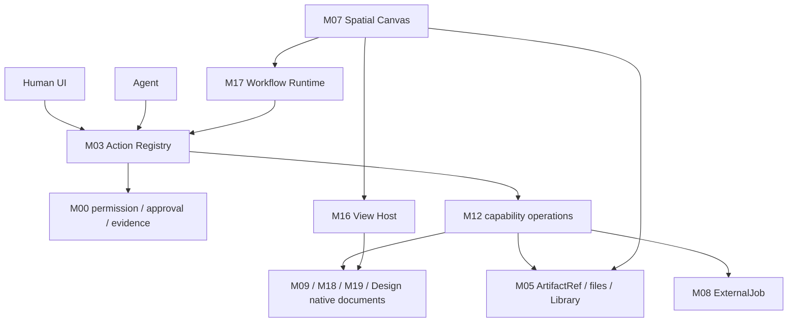

# GPT-5.6 — 项目文档综合审查与整改报告

**日期：** 2026-07-09  
**本轮范围：** 当前项目文档、Fable-5 文件夹四份报告、相关官方项目 README/许可证信息  
**明确未做：** 未读取或审查 `app/` 产品代码，未执行实现，未修改其他模型报告内容  
**结论：** 产品方向已收口；文档体系已纠正关键冲突；所有实现仍应保持 Locked。

官方 Release API 和 Tag 在本轮再次核对：最新稳定基线仍是 Craft Agents OSS
[`v0.11.0`](https://github.com/craft-ai-agents/craft-agents-oss/releases/tag/v0.11.0)，发布于
2026-07-07，Tag 指向 `f4e172bf372f4ccc7389a189be1e0b0541f96282`。

## 1. 执行结论

用户选择的“万能空间操作系统”方向可以实现，但必须采用：

> **空间编排层 + 能力契约层 + 工作流运行层 + 原生编辑器 + 单一治理脊柱**

无限画布不应成为所有功能的数据模型，也不能把浏览器、视频、设计和 PPT 编辑器
全部作为持续运行的活节点塞入画布。正确做法是：

- M07 只拥有空间布局、选择、投影和视觉引用；
- M12 描述模块能力、输入输出端口和运行策略；
- M17 保存并运行可视化工作流；
- M16 统一承载面板、Inspector 和专业 Surface；
- M05 用精确版本的 ArtifactRef 连接文本、图片、视频、网页和演示文档；
- M08 统一管理生成、渲染、导出等异步任务；
- M09/M18/M19 分别拥有媒体工程、网页工程和动态演示文档；
- 人、Agent、工作流调用同一个 M03 ActionDefinition/executor，并经过同一 M00 权限、
  审批和时间线。

当前仍然不能动手写产品代码。原因不是理念不清，而是：v0.11 迁移台账、W0.1 正典
合同、物理持久化、命名空间、关键引擎适配器和精确实现路径还没有证据。

## 2. 删除问题核对

本轮开始时确认根目录 `model-reviews/` 中多份已跟踪报告曾被标记删除，删除范围过大。
已原样恢复：

- Fable-5 原有审查报告；
- GPT-5.6 原有报告；
- Gemini 3.5 Flash 报告；
- Grok 4.5 全套报告；
- `docs/ARCHITECTURAL-COMPARISON.md`。

没有打开或改写除 Fable-5（用户明确要求结合）和 GPT-5.6 自己目录以外的其他模型
报告内容。Fable-5 新增的三份文档保持原样。

同时修正了 `docs/legacy/REVIEW-CONSOLIDATION-2026-07-09.md` 中“原始报告已删除”的错误
说法，改为：报告保留、非绑定、不得由一个模型删除另一个模型的文件夹。

## 3. 对 Fable-5 报告的判断

### 3.1 可直接吸收的部分

1. 规格必须具备字段、接口、错误边界、依赖合同和可照跑验收，不能只有十节接口卡。
2. 人和 Agent 必须走同一个 Action/权限/时间线入口。
3. 画布写入需要持久化、恢复、撤销、冲突、背压和真实性能验证。
4. 工作台需要唯一面板/Surface 注册宿主，不能每个模块各自改 Shell。
5. M08/M09 等长期任务必须有真实状态机、取消、恢复、成本和产物闭环。
6. 文档存在不等于执行就绪；W1 不能因短规格存在而打开。

### 3.2 不能原样采用的部分

1. **固定九种节点不够。** 这仍是设计工具，不是可扩展的万能空间。改为模块贡献的
   Entity Renderer 和 ArtifactRef/WorkflowStep 投影。
2. **OpenPencil 不能直接冻结为万能画布。** 当前官方资料与 Fable 假设不同，见第 4 节。
3. **时间线 seq 不能作为文档冲突算法。** 改为 `baseRevision`、串行提交、
   `committedRevision` 和显式 conflict。
4. **视觉连线不能等于执行连线。** Space 模式的线只表示引用；Workflow 模式的边由
   M17 进行端口校验并提交。
5. **`canvas.export_selection=L0` 却写文件是权限冲突。** 拆为内存渲染和 M05 文件写入。
6. **普通画布卡片删除不应默认 L3。** 删除空间绑定可快照撤销；删除底层文件/资产才由
   所有者按真实风险处理。
7. **Panel 与 Surface 不能共用含糊的单一类型。** 改为 discriminated ViewContribution、
   ViewInstance 和 versioned LayoutSnapshot。
8. **未经测量的 2,000 节点/55fps/固定阈值不应成为合同。** 先冻结可复现基准机和脚本。

### 3.3 Fable 报告自身的漂移

- 一处称 RuntimeLane 类型不存在，另一处又说已进入 stub，缺少审查基线版本。
- 一边警告不要盲目恢复旧规格，一边又建议整段恢复旧版；正确做法只能是逐条迁移。
- 一边要求解决 Fleet 命名，一边继续冻结 `.fleet`、`fleet.*`。
- 一边禁止自建引擎，回退方案又要求自绘 Canvas/SVG 引擎。
- Adapter 是否直接写 SessionEvent、AIGC placeholder 如何原子变成 image、Panel/Surface
  类型等仍有内部冲突。

因此 Fable-5 是重要证据输入，不是可以直接复制的正典规格。

## 4. 画布引擎路线重新核验

本轮只读取了官方仓库说明，不读取其源码。

### [`ZSeven-W/openpencil`](https://github.com/ZSeven-W/openpencil)

当前官方 README 描述的是 Rust/CanvasKit 产品、`.op` 文档和 Design-to-Code；Web SDK 中
的可嵌入能力被描述为只读 Viewer。它不再符合文档中“React 可编辑万能画布 SDK”的
假设。可以继续研究为专业设计模块、CLI/文档工具或只读预览，但不能直接作为 M07
宿主。

### [`open-pencil/open-pencil`](https://github.com/open-pencil/open-pencil)

官方说明提供 `.fig/.pen` 编辑、CLI/MCP 和 Vue SDK。它更接近可编辑专业设计文档，
但 Vue/React 集成、完整回写、性能，以及禁用其内置 Agent/MCP 权威，都需要独立
适配器验证。

### [`xyflow/xyflow`](https://github.com/xyflow/xyflow)

官方项目说明其 React Flow 支持 MIT 许可的自定义节点/边、平移缩放和节点式 UI，
更符合 M07 的模块卡片和工作流端口需求。因此被列为**首选适配器 Spike 候选**，但尚未
获得源码引入绿灯，也没有性能/无障碍/持久化证据。

### [`tldraw/tldraw`](https://github.com/tldraw/tldraw)

能力很适合无限画布和 AI/Workflow/Image Pipeline，但官方明确说明 SDK 生产使用需要
License Key。项目当前定位为免费开源本地软件，不能默认采用；只保留行为参考。

## 5. 最终架构



### 5.1 关键单一事实源

| 状态 | 唯一所有者 |
|---|---|
| 会话、权限、审批、时间线 | M00 |
| Action 定义/调用/幂等/Undo 关联 | M03 |
| 文件、Library、ArtifactRef 元数据 | M05 |
| AgentSeat/RuntimeLane/TeamRun | M04 |
| 异步任务 | M08 |
| 空间位置/视觉引用 | M07 |
| 媒体工程 | M09 |
| 能力清单/Loadout | M12 |
| 视图/Layout | M16 |
| WorkflowDefinition/Run 关联 | M17 |
| 网页工程 | M18 |
| MotionDeck | M19 |

## 6. Agent 与工作流完整闭环

Agent 不通过模拟点击使用模块。流程是：

1. M12 根据 AgentSeat、workspace、task、trust、runtime 得到有效能力清单。
2. Agent 只能看到允许的 CapabilityOperation。
3. Agent 创建显式、版本化、可检查的 WorkflowDefinition。
4. M17 检查端口类型、ArtifactRef、DAG、能力版本、权限路径、预算和并发上限。
5. 用户在 M07/M16 中查看或修改工作流。
6. M17 每一步创建与 UI/Agent 相同的 ActionInvocation。
7. L0/L1 在有限预算和策略内执行；L2 按规则/审批；L3 每次停下等待人类。
8. 长任务交给 M08；文件和产物由 M05 原子提交。
9. 重启后先 reconcile，不重复提交付费生成/渲染/消息。
10. 失败后的 Agent 修复产生新工作流版本，不能悄悄改正在运行的定义。

## 7. 用户例子的可执行映射

```text
文字/Brief
  -> M08 图片生成
  -> Image ArtifactRef(version N)
       -> M18 可编辑网页工程 -> build ArtifactRef
       -> M19 MotionDeck -> HTML/PPTX/video ArtifactRef
       -> M09 MediaProject
            + 视频/音频/字幕/网页渲染片段/演示片段
            -> Render ArtifactRef
```

动态 PPT 的正典不是一个无法编辑的 `.pptx` Blob，而是 MotionDeck 文档。首版可承诺
HTML 动态演示与静态/有限 PPTX 导出；不得在没有真实 PowerPoint 打开验证时声称完整
动画兼容。

## 8. 首个实施顺序

### Slice A — 合同

冻结 caller/idempotency/revision/action policy、ArtifactRef、CapabilityManifest、ExternalJob、
Workflow、SpatialDocument、ViewContribution。

### Slice B — 第一个真实创作环

文字 -> 真实生图 -> M08 durable job -> M05 ArtifactRef -> M07 卡片。必须覆盖 UI、Agent、
Workflow 三入口、审批、失败、取消、重启和成本来源。

### Slice C — Fan-out

同一图片版本分别进入最小真实的 M18/M19/M09 工程，不能只做三个展示卡片。

### Slice D — 多素材剪辑

M09 使用 `MediaProject -> Track -> Clip`，连接图片、视频、音频、文字、字幕和其他模块
渲染片段，再通过 M08 输出真实视频。

## 9. P0 问题

1. v0.11 迁移台账和干净基线尚未完成。
2. W0.1 正典实现/文档合同仍未重冻结。
3. ActionInvocation 不能表达 workflow caller、幂等、关联和文档 revision。
4. 风险等级、审批、Undo、取消、重试、Evidence 仍需正交化。
5. ArtifactRef/Capability/ExternalJob/Workflow/View 合同尚未进入正典协议。
6. 物理存储仍有 SQLite/JSON/原 Craft 存储的冲突，不能让每个模块自建数据库。
7. 产品内部 namespace 未决，不能冻结插件 API 和状态目录。
8. M06/M07/M09/M16/M18/M19 适配器 Spike 尚无证据。
9. 所有权路径仍需在干净 v0.11 上映射；当前不能发 Worker Packet。

## 10. P1 问题

- M02 运行时发现、PTY 终止/输出保留仍需字段级合同。
- M04 必须把 W2 核心与 W4 Batch 扩展拆开，不能循环依赖 M08/M11。
- M13 需要完整 Preference Key/默认值/风险/迁移表。
- M14/M15 已补成合同草案，但仍缺真实 v0.11 路径与适配器。
- M10 已统一成七分区 × 四生命周期 × 敏感度，但物理索引/删除证明仍缺。
- M11 已去掉跨 Provider 固定缓存节省比例和统一 Prompt 顺序，但每个 Provider 仍需
  一手资料验证。
- 历史 Packet/Board/比较报告仍保留，但已明确非绑定，后续可按审慎归档流程处理。

## 11. 已完成的文档整改

核心新增：

- `docs/COMPOSABLE-WORKSPACE-ARCHITECTURE.md`
- `docs/PERSISTENCE-AUTHORITY-MAP.md`
- `docs/DOCUMENT-READINESS.md`
- `docs/adr/0033-composable-workspace-boundary.md`
- `docs/contracts/composable-workspace-contracts.md`（明确为未冻结提案）
- M16 Workbench Panel Platform
- M17 Composable Workflows
- M18 Web Artifact Surface
- M19 Presentation and Motion Surface

核心重写：M01、M03、M05、M06、M07、M08、M09、M10、M11、M12、M14、M15。

控制面同步：Project Direction、Decision Ledger、Wave Map、Ownership Matrix、Module Index、
Start Here、Development Process、Parallel Operating Model、Glossary、Reference Policy、W0.1
Packet、Board、Owner Voice、Human Feedback、协议/Action 冻结说明。

## 12. 仍然不能声称的事实

- 不能声称任何新模块可用、已接线或可开工。
- 不能声称当前 App 已经采用 v0.11。
- 不能声称 xyflow/OpenPencil/媒体/PPTX/Web Adapter 已选定或验证。
- 不能声称 SQLite 是当前正典。
- 不能声称所有 Fable-5 代码事实已在本轮复核；本轮没有读代码。
- 不能声称 PPTX 动画、视频帧精度或画布节点规模达到具体指标。

## 13. 建议的下一步

先由项目 Owner/Lead 审阅下列三份正典设计：

1. `docs/COMPOSABLE-WORKSPACE-ARCHITECTURE.md`
2. `docs/contracts/composable-workspace-contracts.md`
3. `docs/WAVE-MODULE-MAP.md`

确认产品边界后，下一轮只做 W0.1：v0.11 迁移台账、代码/合同正典核对、持久化 ADR、
namespace 决定和关键适配器 Spike 计划。不要直接进入功能开发。
